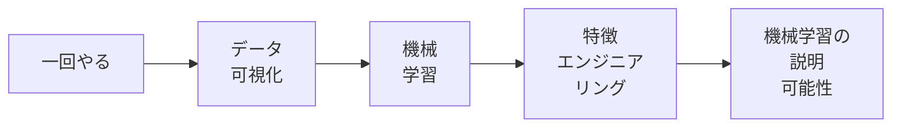
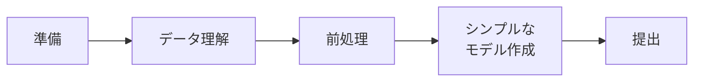

[1.まず一通りやってみる](https://zenn.dev/rg687076/articles/76b1608f4ffe36)
[2.ブラッシュアップのロードマップ)](https://zenn.dev/rg687076/articles/f0c1aa0b59ea76)
[3.Name(敬称)の特徴量エンジニアリング)](https://zenn.dev/rg687076/articles/858ea82fddadc1)
[4.家族人数の特徴量エンジニアリング)](https://zenn.dev/rg687076/articles/52d7e8f375e9ba)
[5.年齢の特徴量エンジニアリング)](https://zenn.dev/rg687076/articles/04f64c76d7ffb6)



https://www.kaggle.com/c/titanic

# Abstract
- KaggleのGetting Started「Titanic」をやってみた活動記録です。
- いきなり高スコアを狙うのではなく、「なぜその結果になるのか」を理解ながら、試行錯誤する形で進めていきます。

# はじめに
Kaggleを初めると、一番最初の挑戦することになるだろう「Titanic」。データ対象の人数が少ない、特徴量が分かりやすい、評価方法がシンプル(生存or非生存)という理由で、まさにGetting Startedという立ち位置のコンペです。とはいえ、いざ触ってみるとNoteBookって何？とか何から手を付ければいいの？とかどれくらい作り込めばいいの？とか、結構戸惑います。このコンペは"何度でも提出できる"というのが特徴なので、理解しながら段階的に精度を上げていく前提で進めます。

# Titanicコンペとは
Titanicコンペは、不沈と言われた豪華客船タイタニック号が、処女航海で沈没した時の「顧客データから、その人が生存したかを予測する」という2値分類問題です。
提供されるデータは以下のようなものです。
・年齢(Age) &emsp;&emsp; ・性別(Sex) &emsp;&emsp; ・客室クラス(PClass)
・料金(Fare) &emsp;&emsp; ・家族構成(Sib,Parch) など
教師データ(train.scv)には生存結果(Survived)が含まれており、テストデータ(test.csv)に対して予測結果を提出します。

# 進め方


今回は以下のステップで進めていきます。

0. [準備](#0.-準備)
1. [データ理解](#1.-データ理解)
2. [前処理](#2.-前処理)
3. [シンプルなモデル作成](#3.-シンプルなモデル作成)
4. [提出](#4.-提出)

## 0. 準備
### 0.1 Notebookの準備
Kaggleサイトの右メニューリストからCodeを選択 → New Notebookを押下

&emsp;&emsp;&emsp;&emsp;&emsp;&emsp;&emsp;&emsp;&emsp;&emsp;&emsp;&emsp;&emsp;&emsp;&emsp;&emsp;&emsp;&emsp;&emsp;&emsp;↓

Notebookが生成されます。
後々、区別ができるように下の赤丸部分の名称を分かりやすい名前に変更します。
今回は「001-Titanic」にしました。


今後再開するときは、Your Workから選択します。


### 0.2 データセットの準備
右ペインのAdd Input押下

検索窓に"Titanic"を入力 → 表示された「Titanic - Machine Learning from Disaster」の＋ボタンを押下

これで、データが一式追加されます。

### 0.3 データセットの確認

実行すると、下記3ファイルのデータが追加されているのが確認できます。
/kaggle/input/competitions/titanic/train.csv
/kaggle/input/competitions/titanic/test.csv
/kaggle/input/competitions/titanic/gender_submission.csv

これで準備は完了です。

## 1. データ理解
いよいよ、機械学習に入ります。学習対象を絞るためにデータ内容をざっくり確認するところからはじめます。

### 1.1 データ読込み
pandasのread_csv()関数で読み込みます。戻りはDataFrame型になります。もうこれはいつもこの形から始まるので勝手に覚えますね。

```python
import pandas as pd

# データ読込み、train_dataという変数名のDataFrame型に格納する
train_data = pd.read_csv('/kaggle/input/competitions/titanic/train.csv') 
# 先頭5行を出力
train_data.head()
```

### 1.2 先頭行を見る
もう、なにも考えることなくとりあえずhead()関数ですね。
データフォーマットが確認できます。
| PassengerId | Survived | Pclass | Name | Sex | Age | SibSp | Parch | Ticket | Fare | Cabin | Embarked |
| :--- | :--- | :--- | :--- | :--- | :--- | :--- | :--- | :--- | :--- | :--- | :--- |
| 1 | 0 | 3 | Braund, Mr. Owen Harris | male | 22.0 | 1 | 0 | A/5 21171 | 7.2500 | NaN | S |
| 2 | 1 | 1 | Cumings, Mrs. John Bradley (Florence Briggs Th... | female | 38.0 | 1 | 0 | PC 17599 | 71.2833 | C85 | C |
| 3 | 1 | 3 | Heikkinen, Miss. Laina | female | 26.0 | 0 | 0 | STON/O2. 3101282 | 7.9250 | NaN | S |
| 4 | 1 | 1 | Futrelle, Mrs. Jacques Heath (Lily May Peel) | female | 35.0 | 1 | 0 | 113803 | 53.1000 | C123 | S |
| 5 | 0 | 3 | Allen, Mr. William Henry | male | 35.0 | 0 | 0 | 373450 | 8.0500 | NaN | S |

列は、PassengerId, Survived, Pclass, Name, Sex, Age, SibSp, Parch, Ticket, Fare, Cabin, Embarkedがあるのが分かります。
|No|列名|概要|
|---|---|---|
|**PassengerId**|乗客ID|1から始まるユニークな識別ID|
|**Survived**|生存フラグ|0:Dead,1:Live(※test.csvには存在しない)|
|**Pclass**|客室クラス|1=1等, 2=2等, 3=3等|
|**Name**|乗客名|名前、敬称を含む|
|**Sex**|性別|male:男性,female:女性|
|**Age**|年齢|年齢（一部欠損あり）|
|**SibSp**|兄弟・配偶者の数|タイタニックに乗船していた兄弟や配偶者の数|
|**Parch**|両親・子供の数|タイタニックに乗船していた両親や子供の数|
|**Ticket**|チケット番号|チケットの識別番号|
|**Fare**|乗船料金|料金|
|**Cabin**|客室番号|客室の番号(欠損多し)|
|**Embarked**|乗船港|C=Cherbourg, Q=Queenstown, S=Southampton|


### 1.3 データの要約を見る
データのばらつき等を確認します。
この確認方法は、数値じゃないデータ列(Sex,Ticket等)は出力しないというのが分かります。
```python
# 訓練データの要約を確認する
train_data.describe()
```
| | PassengerId | Survived | Pclass | Age | SibSp | Parch | Fare |
| :--- | :--- | :--- | :--- | :--- | :--- | :--- | :--- |
| **count** | 891.000000 | 891.000000 | 891.000000 | 714.000000 | 891.000000 | 891.000000 | 891.000000 |
| **mean** | 446.000000 | 0.383838 | 2.308642 | 29.699118 | 0.523008 | 0.381594 | 32.204208 |
| **std** | 257.353842 | 0.486592 | 0.836071 | 14.526497 | 1.102743 | 0.806057 | 49.693429 |
| **min** | 1.000000 | 0.000000 | 1.000000 | 0.420000 | 0.000000 | 0.000000 | 0.000000 |
| **25%** | 223.500000 | 0.000000 | 2.000000 | 20.125000 | 0.000000 | 0.000000 | 7.910400 |
| **50%** | 446.000000 | 0.000000 | 3.000000 | 28.000000 | 0.000000 | 0.000000 | 14.454200 |
| **75%** | 668.500000 | 1.000000 | 3.000000 | 38.000000 | 1.000000 | 0.000000 | 31.000000 |
| **max** | 891.000000 | 1.000000 | 3.000000 | 80.000000 | 8.000000 | 6.000000 | 512.329200 |

describe()を実行することで下記の推察が立ちます。
- countから、データ件数は891件、Age列に欠損値がありそう。
- meanから、生存率(Survived)は38%、平均年齢は29歳。
- stdは標準偏差。どれだけ散らばっているかの指標。
- min/maxは値の最大値、最小値

### 1.4 列を絞る
ドメイン知識から効きそうな列を選定します。
- [Sex](#sex\(性別\))(性別) ... 「女性と子供を優先」ルールから、強い相関があると予想できる。
- [Pclass](#pclass\(客室クラス\))(客室クラス) ... 高い客室ほど救助されやすそうというのは想像できる。
- [Age](#age\(年齢\))(年齢) ... 子供優先が生存率に影響しそう。
- [Fare](#fare\(運賃\))(運賃) ... Pclassと同じ考え方から。

ひとまずこの4つに絞りました。

実際に確認してみます。
#### Sex(性別)
```python
sexmean = train_data.groupby("Sex")["Survived"].mean()
print(sexmean)
```
Sex: Sex
female    0.742038
male      0.188908
Name: Survived, dtype: float64

--> 予想通り、female(女性)の方が生存率が高いですね。学習対象にすると有意な結果が得られそうです。

#### Pclass(客室クラス)
```python
pclassmean = train_data.groupby("Pclass")["Survived"].mean()
print(pclassmean)
```
Pclass: Pclass
1    0.629630
2    0.472826
3    0.242363
Name: Survived, dtype: float64

--> 予想通り、客室クラス毎に生存率に違いがあるのが分かります。1等客室が一番高いんだろうなぁ。

#### Age(年齢)
年齢別に生存率を見ると傾向が分かるかと思ったんですが、ダメですね。
バラバラすぎて全然分からない。
```python
import matplotlib.pyplot as plt

age_survival = train_data.groupby("Age")["Survived"].mean()
age_survival.plot()
plt.xlabel("Age")
plt.ylabel("Survival Rate")
plt.show()
```


なので、年齢層で分けてみると傾向が見えてきました。若年層ほど生存率は高くなります。
```python
import matplotlib.pyplot as plt

age_bin = pd.cut(train_data["Age"], bins=[0, 12, 18, 35, 60, 100])
age_survival = train_data.groupby(age_bin)["Survived"].mean()
print(age_survival)
overall_mean = train_data["Survived"].mean()
age_survival.plot(kind="bar")
plt.axhline(overall_mean, color="red") # 全体の平均生存率
plt.xlabel("AgeBin")
plt.ylabel("Survival Rate")
plt.show()
```
Age
(0, 12]      0.579710
(12, 14]     0.625000
(14, 16]     0.434783
(16, 18]     0.384615
(18, 20]     0.300000
(20, 22]     0.307692
(22, 35]     0.409774
(35, 60]     0.400000
(60, 100]    0.227273
Name: Survived, dtype: float64


--> 若年層ほど生存率は高くなります。境目は16歳未満っぽい。

#### Fare(運賃)
運賃も幅で確認しないと分かりにくいです。やはりグラフでも確認するほうが見やすいですね。

```python
import matplotlib.pyplot as plt

faremean = train_data.groupby("Fare")["Survived"].mean()
count = train_data.groupby("Fare")["Survived"].count()
fare_bin = pd.cut(train_data["Fare"], bins=[0, 30, 40, 50, 60, 70, 80, 100, 150, 200])
fare_survival = train_data.groupby(fare_bin)["Survived"].mean()
print(fare_survival)

overall_mean = train_data["Survived"].mean()
fare_survival.plot(kind="bar")
plt.axhline(overall_mean, color="red") # 全体の平均生存率
plt.xlabel("FareBin")
plt.ylabel("Survival Rate")
plt.show()
```
70以上で有意な差がありそうです。50～60の生存率が高いのも気になります。何か別の要因がありそうですがひとまずは無視します。

Fare
(0, 30]       0.319315
(30, 40]      0.396552
(40, 50]      0.250000
(50, 60]      0.710526
(60, 70]      0.352941
(70, 80]      0.612903
(80, 100]     0.857143
(100, 150]    0.791667
(150, 200]    0.666667
Name: Survived, dtype: float64
Fare
(0, 30]       642
(30, 40]       58
(40, 50]       16
(50, 60]       38
(60, 70]       17
(70, 80]       31
(80, 100]      21
(100, 150]     24
(150, 200]      9
Name: Survived, dtype: int64


これら4つは有意な差が得られそうですね。

## 2. 前処理
前処理では下記を実行します。
  1. 欠損値をどう処理するかの方針を決める。
  2. 列のうち数値ではない列(文字列で保持している列)をどう数値に変換するかの方針を決める。

### 2.1 欠損値をどう処理するかの方針を決める。
方針を決める前に、どの列が欠損値を含む列なのかを確認します。

#### 2.1.1 欠損値を含む列を確認する。
pythonは欠損値確認が、下記コードで簡単に確認できます。
```python
missing_count = train_data.isnull().sum()
print(missing_count)
```
PassengerId      0
Survived         0
Pclass           0
Name             0
Sex              0
Age            177
SibSp            0
Parch            0
Ticket           0
Fare             0
Cabin          687
Embarked         2
dtype: int64

Ageに177個、Cabinに687個、Embarkedに2個あるのが確認できました。
※今回は、Cabin、Embarked は使用しないのでAgeだけ修正します。

#### 2.1.2 欠損値の方針を決める
学習に使用する列は、Sex(性別)、Pclass(客室クラス)、Age(年齢)、Fare(運賃)の4つに絞りました。その列で欠損値が含まれるのはAgeだけ。
今回の目的は、"まず一通りやってみる"なので、あまり考えず中央値(median)で埋めることにします。先の改善で見直したいと思います。
--> Ageを中央値(median)で埋める。

### 2.2 列のうち数値ではない列(文字列で保持している列)をどう数値化するかの方針を決める。
基本的に、文字列の列はそのまま渡して学習することはできません。事前に数値へ変更する必要があります。

#### 2.2.1 数値ではない列を確認する。
型情報を見ると、どの列が数値か否かが一目瞭然です。
```python
train_data.info()
```
No Column   Count    Non-Null Dtype  

 0   PassengerId  891 non-null    int64  
 1   Survived     891 non-null    int64  
 2   Pclass       891 non-null    int64  
 3   Name         891 non-null    object 
 4   Sex          891 non-null    object 
 5   Age          714 non-null    float64
 6   SibSp        891 non-null    int64  
 7   Parch        891 non-null    int64  
 8   Ticket       891 non-null    object 
 9   Fare         891 non-null    float64
 10  Cabin        204 non-null    object 
 11  Embarked     889 non-null    object 
dtypes: float64(2), int64(5), object(5)

Name,Sex,Ticket,Cabin,Embarked が数値でない列ですね。
そのうち、今回使うのはSexだけ。

#### 2.2.2 数値化の方針を決める
今回は、文字列を数値に置換する方向で対応します。
 --> Sexを、{'male':0, 'female':1} で置換する。

## 3. シンプルなモデル作成
さて、方針が決まったのでモデル作成に進みます。
下記コードでモデル生成 → 学習 → 予測ができます。
```python
import pandas as pd
from sklearn.tree import DecisionTreeClassifier

# データ読み込み
train_data = pd.read_csv("/kaggle/input/titanic/train.csv")
test_data = pd.read_csv("/kaggle/input/titanic/test.csv")

# 4つの特徴量を選択
features = ["Pclass", "Sex", "Age", "Fare"]

# 学習データを準備
X = train_data[features].copy()
y = train_data["Survived"]
X_test = test_data[features].copy()

# 欠損値補完
X["Age"] = X["Age"].fillna(X["Age"].median())
X_test["Age"] = X_test["Age"].fillna(X_test["Age"].median())
X_test["Fare"] = X_test["Fare"].fillna(X_test["Fare"].median())

# Sex を数値化
X["Sex"] = X["Sex"].map({"male": 0, "female": 1})
X_test["Sex"] = X_test["Sex"].map({"male": 0, "female": 1})

# モデル作成
model = DecisionTreeClassifier(random_state=1)

# 学習
model.fit(X, y)

# 予測
predictions = model.predict(X_test)

# 提出ファイル作成
output = pd.DataFrame({
    "PassengerId": test_data["PassengerId"],
    "Survived": predictions
})

# 提出ファイル出力
output.to_csv("submission.csv", index=False)

# 完了
print("submission.csv を作成しました")
```

## 4. 提出
いよいよ提出します。
下記コードを実行すると、submission.csv が出来てるはずです。
```python
!ls -al
```
/kaggle/working
total 4
-rw-r--r-- 1 root root 2839 Apr 18 07:54 **submission.csv**

右下にある"Submit to competition"押下して開いて、"Submit"ボタン押下

&emsp;&emsp;&emsp;&emsp;&emsp;&emsp;&emsp;&emsp;&emsp;&emsp;&emsp;&emsp;&emsp;&emsp;&emsp;&emsp;**↓**
右下の"Submit"ボタン押下


提出が成功して、何やら処理が動き出す。
&emsp;&emsp;&emsp;&emsp;&emsp;&emsp;&emsp;&emsp;&emsp;&emsp;&emsp;&emsp;&emsp;&emsp;&emsp;&emsp;**↓**


&emsp;&emsp;&emsp;&emsp;&emsp;&emsp;&emsp;&emsp;&emsp;&emsp;&emsp;&emsp;&emsp;&emsp;&emsp;&emsp;**↓**

処理が終わったらしい。Completeが表示される。
赤丸のCompleteを押下。


&emsp;&emsp;&emsp;&emsp;&emsp;&emsp;&emsp;&emsp;&emsp;&emsp;&emsp;&emsp;&emsp;&emsp;&emsp;&emsp;**↓**
Competitionsのページに飛ぶ → 結果が表示される。


現在のスコアは 0.71052 と表示されいます。
これで、提出までの一通りの流れが完了しました。

ちなみに、
"Competitions" → "Your Work"押下


"Titanic - Machine Learning form Disaster"押下


"Leaderboard"押下


"↓ Jump to your leaderboard position"押下


自分のランキング位置に移動します。11968位だって。全体で何人いるんだという。


次からこのスコアを上げるべくいろいろ工夫します。
お疲れ様でした。

次[[2.ブラッシュアップのロードマップ](https://zenn.dev/rg687076/articles/f0c1aa0b59ea76)]へ