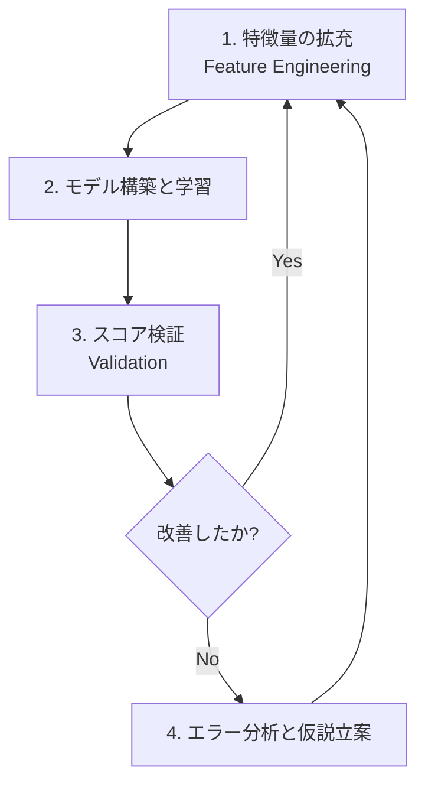

[1.まず一通りやってみる](https://zenn.dev/rg687076/articles/76b1608f4ffe36)
[2.ブラッシュアップのロードマップ)](https://zenn.dev/rg687076/articles/f0c1aa0b59ea76)
[3.Name(敬称)の特徴量エンジニアリング)](https://zenn.dev/rg687076/articles/858ea82fddadc1)
[4.家族人数の特徴量エンジニアリング)](https://zenn.dev/rg687076/articles/52d7e8f375e9ba)
[5.年齢の特徴量エンジニアリング)](https://zenn.dev/rg687076/articles/04f64c76d7ffb6)

https://www.kaggle.com/c/titanic

# Abstract
- [前回](https://zenn.dev/rg687076/articles/76b1608f4ffe36)作成したベースラインのモデルを上回るべく、そのロードマップを検証します。

# 概要

前回一通り、機械学習を実施し提出しました。そのスコアは0.71052、順位は12248位。上に何人いるんだよって言うぐらいの順位ですが、現状のスコアを少しでも上げるべくブラッシュアップします。Titanicで検索すると先人たちの手法がいくらでも出てくるので、先人に感謝しながらその手法を拝借します。

# モデルを育てる「ブラッシュアップ・サイクル」
Titanicに限らず、一般にモデルをブラッシュアップするには、作成したベースラインを起点に、以下の「構築と検証のサイクル」を繰り返していくことになります。


## 1. 特徴量の拡充 (Feature Engineering)
ベースラインモデルの作成には、Pclass, Sex, Age, Fare の生データに近い4つの項目だけしか使用していません。まだまだ、データセットには Name（名前）や SibSp/Parch（家族構成）、Embarked（乗船地）といった情報が眠っています。これらを「モデルが生存予測のヒントにしやすい形」に加工して追加していきます。
今のフェーズは、「手持ちの武器を最大限に増やす」です。

## 2. モデル構築と学習
増やした特徴量を使って、再度学習を行います。ここでは特徴量との相性を見ながら、Random Forestや、より強力なアルゴリズム（LightGBMなど）への入れ替えも検討します。

## 3. スコア検証 (Validation)
新しい特徴量を入れたことで、スコアが 0.71052 からどう変化したかをチェックします。
ここで大事なのは「順位」だけでなく、手元の検証スコアと提出スコアの「伸びの連動」を見ることです。

## 4. エラー分析と仮説立案
一通り「目に見えるデータ」を使い切ってもスコアが頭打ちになった時、初めて「なぜこの人は予測が外れたのか？」を深く掘り下げます。この工程が、より高度なEDAと仮説立案の出番です。

# 現状のデータ整理
一通りモデル作成完了現時点での全データを整理します。データ自体が変わったわけではないですが、解釈が変わってます。

|No|列名|列名(和名)|備考|
|---|---|---|---|
|~~1~~|~~PassengerId~~|~~乗客ID~~|未使用。学習には何も意味をなさない。|
|~~2~~|~~Survived~~|~~生存フラグ~~|正解そのものなので、学習には使用しない。|
|~~3~~|~~Pclass~~|~~客室クラス~~|1=1等,2=2等,3=3等。使用済。改善余地なし。|
|4|**Name**|乗客名|名前、敬称を含む。|
|~~5~~|~~Sex~~|~~性別~~|male:男性,female:女性。使用済。改善余地なし。|
|6|**Age**|年齢|年齢(欠損値補完の改善余地あり)|
|7|**SibSp**|兄弟・配偶者の数|兄弟や配偶者の数|
|8|**Parch**|両親・子供の数|両親や子供の数|
|9|**Ticket**|チケット番号|チケットの識別番号|
|10|**Fare**|乗船料金|料金|
|~~11~~|~~Cabin~~|~~客室番号~~|客室の番号(欠損多すぎて使えない)|
|12|**Embarked**|乗船港|C=Cherbourg, Q=Queenstown, S=Southampton|

ブラッシュアップの要素としては、まだ「 median で埋めただけ」の欠損値処理を見直したり、眠っている他の列を叩き起こしたりすることが出来そうです。
また、名前（Name）から「敬称」を抜き出すといった、Titanic攻略の王道とも言える「特徴量エンジニアリング」も可能性がありそう。

# 欠損値状況も確認
欠損値をどう埋めるかはスコアアップに重要な観点なので、グラフと表で確認しておきます。

まずはコードです。
```python
import matplotlib.pyplot as plt
import matplotlib.ticker as mtick
import seaborn as sns

fig, ax1 = plt.subplots(figsize=(10, 5))

ax1.bar(missing_count.index, missing_count.values, color="skyblue", alpha=0.7)
ax1.set_ylabel("Missing Count")
ax1.tick_params(axis='x', rotation=90)

ax2 = ax1.twinx()
ax2.plot(missing_rate.index, missing_rate.values, color="red", marker="o")
ax2.set_ylabel("Missing Rate")
ax2.yaxis.set_major_formatter(mtick.PercentFormatter(1.0))
print(missing_count)
print('-----------------')
print(missing_rate)

# 欠損率ラベル追加
for i, v in enumerate(missing_rate.values):
    ax2.text(i, v + 0.02, f"{v:.1%}", ha='center', color='red')
    
plt.show()
```
数値データです。
Cabin(客室番号)の687個が飛びぬけてますね。
```
PassengerId      0
Survived         0
Pclass           0
Name             0
Sex              0
Age            177
SibSp            0
Parch            0
Ticket           0
Fare             0
Cabin          687
Embarked         2
dtype: int64
'-----------------
PassengerId    0.000000
Survived       0.000000
Pclass         0.000000
Name           0.000000
Sex            0.000000
Age            0.198653
SibSp          0.000000
Parch          0.000000
Ticket         0.000000
Fare           0.000000
Cabin          0.771044
Embarked       0.002245
dtype: float64
```
グラフです。
可視化すると見やすくなります。

Cabin(客室番号)の欠損率大きすぎて、この列は破棄ですね。
Age(年齢)は工夫の余地がありそうです。
Embarked(乗船港)も工夫の余地ありそうですね。

次回から具体的に特徴量を検討していきます。
次[3.Name(敬称)の特徴量エンジニアリング](https://zenn.dev/rg687076/articles/858ea82fddadc1)へ