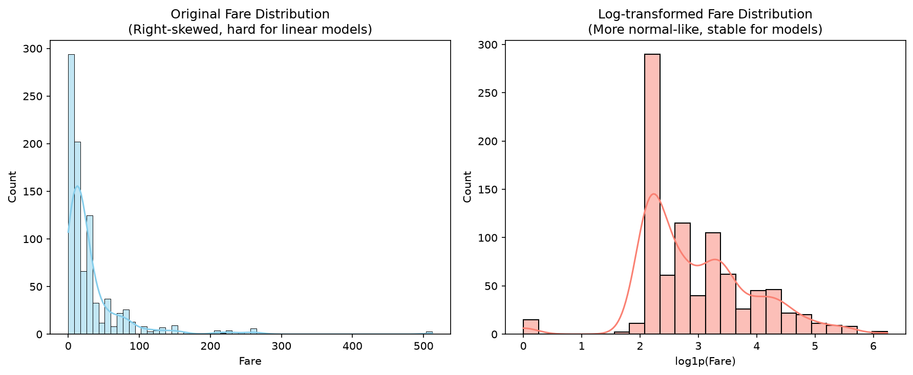
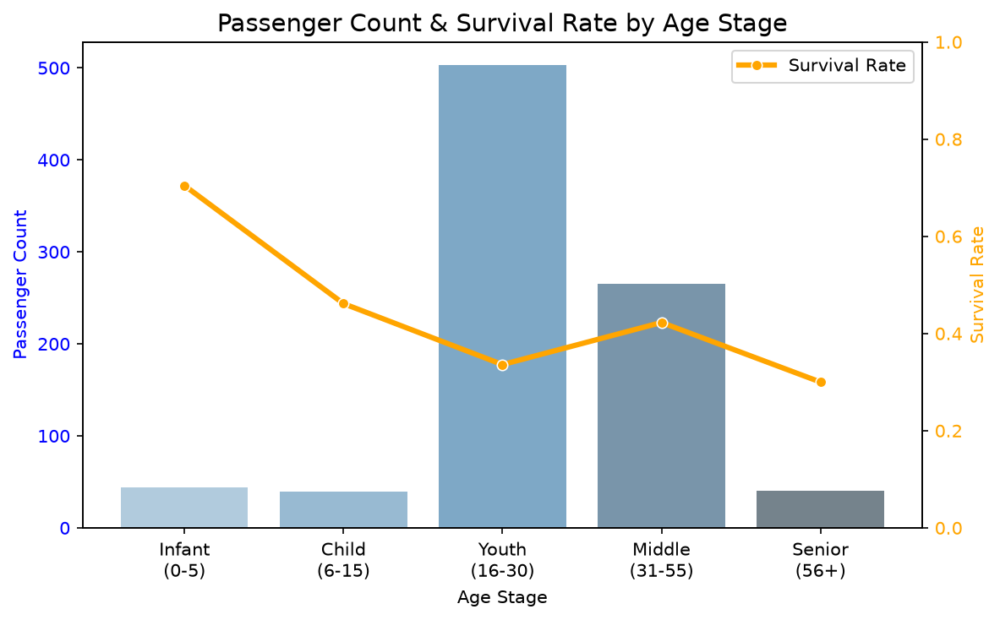

[Kaggle実践1(『Titanic生存者予測』1.ローカルPCにKaggle Titanicの実行環境をつくる](https://zenn.dev/rg687076/articles/zenn_260627_0000_00_create_local_titanic_env)
[Kaggle実践1(『Titanic生存者予測』2.初回提出](https://zenn.dev/rg687076/articles/zenn_260627_0000_01_first_submission)
[Kaggle実践1(『Titanic生存者予測』3.Cabinの特徴量エンジニアリング](https://zenn.dev/rg687076/articles/zenn_260627_1940_01_cabin_feature)
[Kaggle実践1(『Titanic生存者予測』4.特徴量エンジニアリング(ランダムフォレストによる年齢補完)](https://zenn.dev/rg687076/articles/zenn_20260702_2031_age_imputation)
[Kaggle実践1(『Titanic生存者予測』5.特徴量エンジニアリング(数値特徴量の非線形変換とビン化)](https://zenn.dev/rg687076/articles/zenn_20260703_2025_fare_log_and_age_binning)

https://www.kaggle.com/c/titanic

← [Kaggle入門14(ゲームAIと強化学習入門)](https://zenn.dev/rg687076/articles/49e1d162bfdeec)
&emsp;&emsp;&emsp;&emsp;&emsp;&emsp;&emsp;&emsp;&emsp;&emsp;&emsp;&emsp;&emsp;&emsp;&emsp;&emsp;&emsp;&emsp;&emsp;&emsp;&emsp;&emsp;&emsp;&emsp;&emsp;&emsp;&emsp;&emsp;&emsp;[Kaggle実践2(xxxx)](https://zenn.dev/rg687076/articles/xxxx) →

[github公開中](https://github.com/kito2718/KaggleTitanic)

# Abstract

- 数値特徴量である運賃(Fare) の対数変換による歪み緩和と、年齢(Age) の年齢層別ビン化(カテゴリ化) を適用した話。
- CV精度の大幅向上。
- Public Score も大幅向上 0.78947 → **0.79665** (過去最高！)

## 概要

ここまでCV: 0.8519、Public Score: 0.78947。
今回は、数値特徴量のスケール補正と、非線形な関係を捉える特徴量エンジニアリングを実施してスコアアップを目指してみた。

## 施策の内容

### 1. Fare(運賃) の対数変換
タイタニックの `Fare` は、一部の富裕層が極端に高いチケット代を払っていて、結果的に、分布が右に偏った形(ロングテール) になってます(下左グラフ)。この歪みを解消するために、対数変換 `log1p(Fare)` を適用してみた(下右グラフ)。
極端に偏った分布は、対数変換することで右側のような「正規分布」に近づけることができるます。

ロジスティック回帰のような「線形モデル」は、入力されるデータが正規分布に近い形をしている方が、圧倒的に予測しやすくて学習が安定します。

### 2. Age (年齢) の年齢層別ビン化
年齢そのものを数値としてモデルに入れるだけでは、線形モデルは「年齢が高いほど生存しやすい(またはその逆)」という直線的な関係を捉えることになりますが、実際の生存率は「乳幼児や子供は高く」「若者は低い」といった非線形な関係になってます。
下グラフでは、年齢による生存率(オレンジの折れ線) がジグザグに推移しとるのが分かります(つまりは非線形)。

このジグザグな関係をモデルに教えるために、年齢を以下の5つの箱(年齢層) に分割し、カテゴリダミー変数としてモデルに与えることで、複雑な境界線を学習できるようにします。
- 乳幼児 (0-5歳)
- 子供 (6-15歳)
- 若者 (16-30歳)
- 中年 (31-55歳)
- 高齢者 (56歳以上)

## 多重共線性を考慮した4つの検証パターン

対数変換した `Log_Fare` やビン化した `Age_Bin` は、元の `Fare` や `Age` と強い相関(多重共線性) を持つため、両方残すとモデルが不安定になることがあるます。そこで、総当たりでCV (5-Fold Stratified Cross-Validation) スコアを比較評価しました。

- **パターンA**: 元の `Fare`, `Age` を残したまま、`Log_Fare` と `Age_Bin` ダミー変数を追加
- **パターンB**: 元の `Fare` を `Log_Fare` に置換 (元の `Fare` は除外)、元の `Age` は残して `Age_Bin` ダミー変数を追加
- **パターンC**: 元の `Fare` を `Log_Fare` に置換 (元の `Fare` は除外)、元の `Age` も除外して `Age_Bin` ダミー変数のみを使用
- **パターンD**: 元の `Fare` は残し、元の `Age` を除外して `Age_Bin` ダミー変数のみを使用

## 検証結果 (5-Fold CV Accuracy)

| モデル | ベースライン | パターンA | パターンB | パターンC | パターンD |
| :--- | :--- | :--- | :--- | :--- | :--- |
| **Logistic Regression** | **0.8519** | 0.8474 | 0.8474 | 0.8474 | 0.8440 |
| **Random Forest** | 0.8249 | 0.8238 | 0.8170 | **0.8339 (向上!)** | 0.8271 |
| **XGBoost** | 0.8226 | 0.8159 | 0.8170 | **0.8283 (向上!)** | 0.8272 |
| **LightGBM** | 0.8485 | 0.8474 | 0.8474 | **0.8496 (向上!)** | 0.8496 |

### 考察
- **ロジスティック回帰**: 年齢をグループ化 (ダミー変数化) したことで、連続値としての詳細な年齢情報が失われ、いずれのパターンもベースライン (0.8519) を下回ってます。
- **決定木系モデル (Random Forest, XGBoost, LightGBM)**: パターンC (元の `Age` と元の `Fare` を完全に除外) において、すべての木モデルでスコアが大きく向上！
  - **Random Forest**: 0.8249 -> **0.8339** (+0.0090)
  - **XGBoost**: 0.8226 -> **0.8283** (+0.0057)
  - **LightGBM**: 0.8485 -> **0.8496** (+0.0011)
  - 歪んだ分布の `Fare` を対数変換して元の値を除外し、`Age` もカテゴリ情報のみに絞ったことで、決定木が必要以上に深い不要な過学習を起こすのを防ぐことができたと考えられます。

## Kaggle提出

全体の最高CV値はロジスティック回帰ベースライン(0.8519) を上回ることはできてないものの、モデルとしての表現力が向上した**パターンCのLightGBM (CV: 0.8496)**を用いてテストデータの予測を出力し、Kaggleに提出。

- **Public Score**: **0.79665** (前回最高 0.78947 から向上しました。)

ロジスティック回帰のCVスコアが高かったものの、実際のテストデータ (Public Score) に対する予測においては、対数変換とビン化を施して汎化性能を高めた LightGBM の方が高い結果を出すことができました！

使用したコードは、ノートブック [titanic_eda_20260703_2025_fare_log_and_age_binning.ipynb](https://github.com/kito2718/KaggleTitanic/blob/main/notebooks/titanic_eda_20260703_2025_fare_log_and_age_binning.ipynb) としてコミット。

## まとめ

数値特徴量の対数変換とビン化は、決定木モデルの表現力向上に非常に有効であることが実証できたました。
今後は、さらに精度を上げるために「Optuna を使ったハイパーパラメータチューニング」や、向上した決定木モデルと強力な線形モデルを組み合わせる「アンサンブル学習 (スタッキング)」などですかね。
