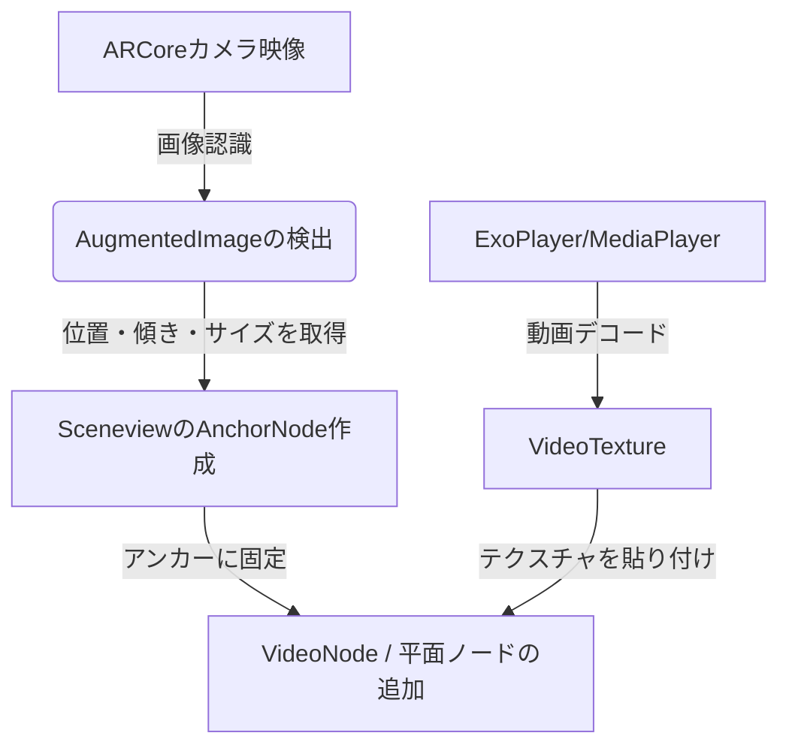
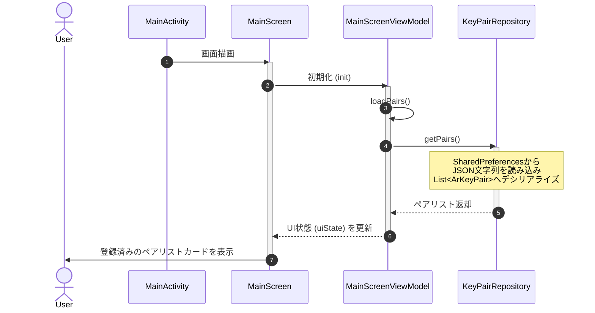
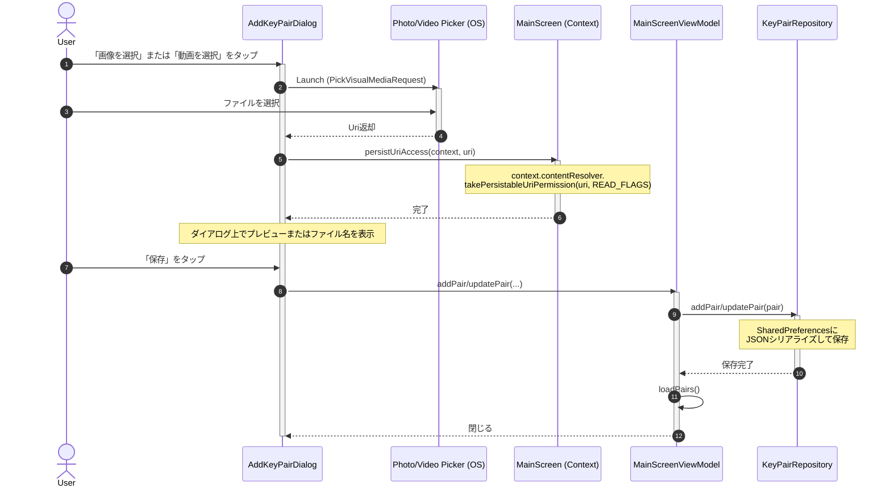
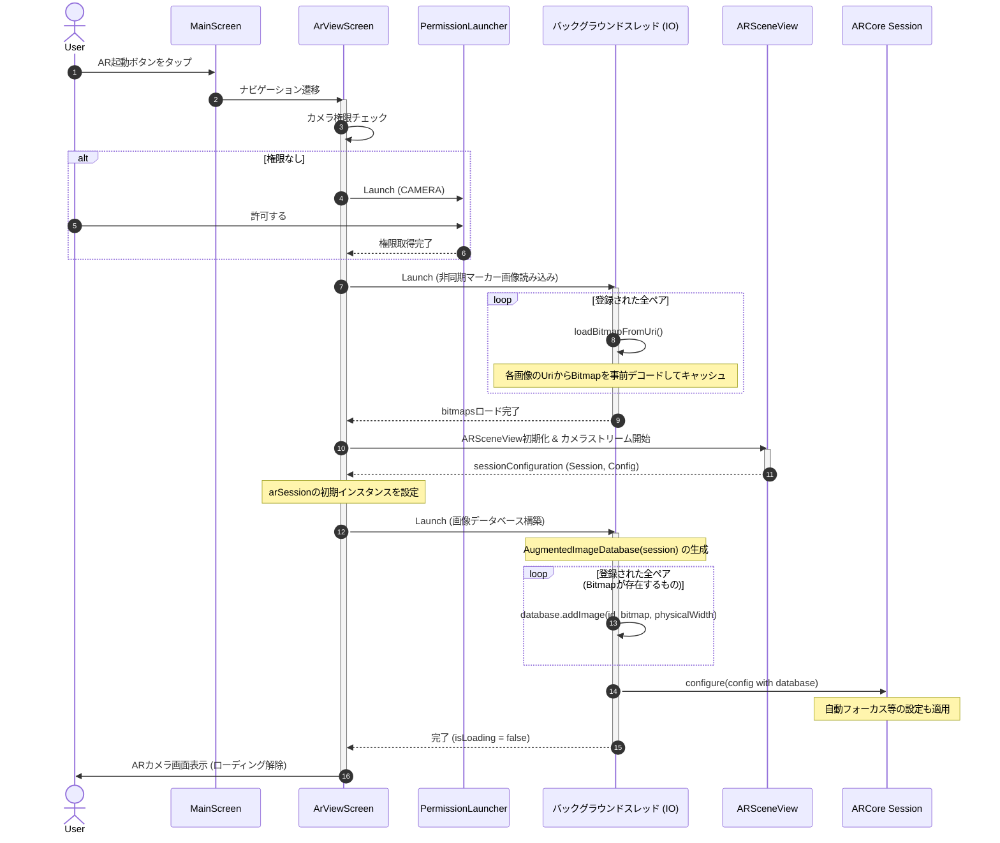
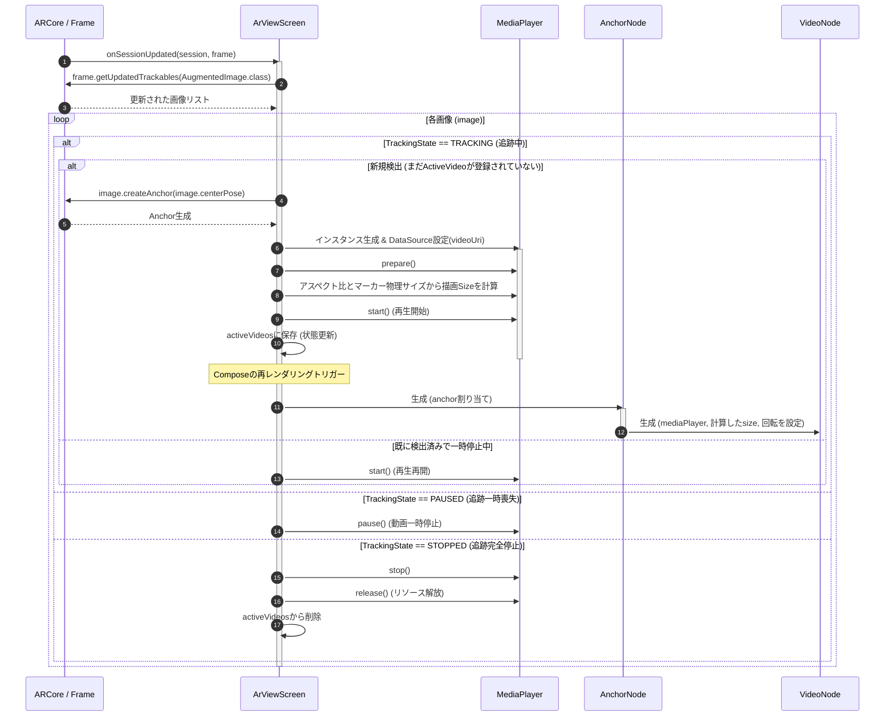

# Abstract
* ARCoreを使った画像認識ARアプリの開発の話

# 概要
以前公開したARアプリ [VideoPhotoBook](https://play.google.com/store/apps/details?id=com.tks.videophotobook&hl=ja) は、Vuforiaライブラリを使って実装してたんだけど、それで特に問題もなかったんだけど、Google公式のARCoreでも画像認識ができるのが分かったので公開してみた。

アプリ: [VideoPhotoBookv3](まだ未定)
github: [VideoPhotoBookv3](https://github.com/kito2718/VideoPhotoBookv3)
zennポスト: [ARCoreを使った画像認識ARアプリを公開してみた](https://zenn.dev/rg687076/articles/zenn_20260705_1044_make_a_videophotobookv3)
DEV.toポスト: [考え中](まだ未定)

## 1. 要件
*   **機能**: ギャラリーから選んだ画像（マーカー）と動画をセットで登録し、カメラでその画像を写すと、その画像の上に動画がピッタリ重なって再生される。
*   **複数ペア対応**: リスト形式で複数の「画像 ⇄ 動画」ペアを登録でき、AR起動時には登録されたすべてのマーカーを同時に追跡・再生可能とする。
*   **デザイン**: ミニマルデザインで。

## 2. 画面設計(UI Design)

ミニマルデザインの原則(十分な余白、洗練されたフォント、無駄のない配色)で実装。

### 設定リスト画面:
アプリ起動時の画面です。
* **ペア一覧(カードリスト):**
    * リスト表示。
    * 各項目には、マーカー画像(サムネ表示)、動画ファイル名、マーカーの実サイズ、動画の拡縮率。
    * 編集機能: 各行のカード自体をタップすると「ペア編集ダイアログ」が起動し、登録済みの画像、動画、および物理横幅サイズを個別に変更・上書き保存可能。
    * 選択されたすべてのペアがARCoreのトラッキング対象となる。
* **新規追加・編集ダイアログ**:
    * 新規追加ができること。
    * 画像プレビュー: 視覚的に対象マーカーを確認しながらペア設定を設定可能にする。
* **AR起動ボタン**:
    * 1つ以上のペアが登録されている場合に画面下部に表示される、シンプルな細身の黒いボタン。

### ARカメラ画面(AR Camera View Screen): 
* カメラプレビュー: 全画面表示。
* 戻るボタン: 左上に配置のシンプルな矢印アイコン。
* ステータス表示: マーカーを探索中か、トラッキング中かを示す控えめなテキスト。

# 3. 機能設計(Technical & Functional Design)

## ① データモデルの永続化 (Data Model)
複数のペア情報をローカルに保存するため、以下のデータ構造を定義。

```kotlin
data class ArKeyPair(
    val id: String,          // 一意識別子(UUID)
    val markerUri: String,   // ギャラリーから選択した画像のURI
    val videoUri: String,    // ギャラリーから選択した動画のURI
    val physicalWidth: Float, // マーカー画像の実際の物理的な横幅（メートル、デフォルト0.1m = 10cm）
    val scaleFactor: Float   // 拡大率（倍率、デフォルト1.0 = 100%）
)
```
※ `SharedPreferences` を使用。

### ② SceneviewによるAR描画
AR空間の描画には、Googleの3Dレンダラ「Filament」をベースにしたライブラリ **`Sceneview`** を使用。

#### Sceneviewの仕組みと動画重ね合わせの概要：


1.  **`ARScene` コマンド**:
    Jetpack Compose用に提供されている `ARScene` を画面Bに配置。これで、カメラプレビューの描画やARCoreセッションの管理が自動的に実行される。
2.  **動的データベースの非同期構築 (Non-blocking database generation)**:
    起動時に登録済みの `ArKeyPair` リストから画像を読み込み、ARCoreの `AugmentedImageDatabase` に `database.addImage(id, bitmap, physicalWidth)` で追加します。この登録処理はCPU負荷が非常に高いので、バックグラウンドスレッドで実行する。
3.  **トラッキングとアンカーの紐付け**:
    ARCoreが画像を検出すると、その位置情報を持つ `Anchor` が作成されます。Sceneviewでは、このアンカーの位置に **`AnchorNode`** を配置する。
4.  **`VideoNode` による動画再生**:
    * Sceneviewには、動画を3D空間上で再生するための **`VideoNode`**(平面に動画テクスチャを貼る仕組み)が用意されてるのでそれを使う。
    * `ExoPlayer` インスタンスを作成、動画の再生ソースとして選択された `videoUri` を指定。
    * これを `VideoNode` に紐付ける。検出した画像の物理サイズに合わせて、動画がピタッとその場所に貼り付いて再生されます。

# 4. シーケンス

## 1. 起動
### シーケンス図



### 解説
アプリ起動時に、SharedPreferencesに保存された画像・動画のペアデータ(JSON文字列) を非同期で読み込み。デシリアライズされたデータは `MainScreenViewModel` の `uiState`(StateFlow)で、UIに通知、Jetpack Composeによりリストカードとして画面上に表示される。

### 該当処理
* **`MainScreenViewModel.kt`**:
  ```kotlin
  class MainScreenViewModel(private val repository: KeyPairRepository) : ViewModel() {
      private val _uiState = MutableStateFlow<List<ArKeyPair>>(emptyList())
      val uiState: StateFlow<List<ArKeyPair>> = _uiState.asStateFlow()

      init { loadPairs() }

      fun loadPairs() {
          viewModelScope.launch {
              _uiState.value = repository.getPairs()
          }
      }
  }
  ```
* **`KeyPairRepository.kt`**:
  ```kotlin
  fun getPairs(): List<ArKeyPair> {
      val json = prefs.getString(key, null) ?: return emptyList()
      return try {
          val type = object : TypeToken<List<ArKeyPair>>() {}.type
          gson.fromJson(json, type) ?: emptyList()
      } catch (e: Exception) {
          emptyList()
      }
  }
  ```

## 2. 画像・動画選択と永続権限取得
### シーケンス図



### 解説
Android の Photo Picker で、画像・動画の `Uri` を取得。
※Photo Picker 等で取得した `Uri` はアプリ再起動時にアクセス権限が切れるため、解決のために、取得した `Uri` に対して `takePersistableUriPermission` を実行し、永続的な読み取りアクセス権を取得する。これで、アプリの再起動後もユーザーが設定したファイルへ問題なくアクセスし続けることが可能となる。

### 該当処理
* **`MainScreen.kt` (Photo Picker起動とURI永続アクセス権の要求)**:
  ```kotlin
  // 永続アクセス権の取得ヘルパー
  private fun persistUriAccess(context: Context, uri: Uri) {
      try {
          val takeFlags: Int = Intent.FLAG_GRANT_READ_URI_PERMISSION
          context.contentResolver.takePersistableUriPermission(uri, takeFlags)
      } catch (e: SecurityException) {
          // 例外処理
      }
  }

  // Photo Picker の契約
  val pickImageLauncher = rememberLauncherForActivityResult(
      contract = ActivityResultContracts.PickVisualMedia()
  ) { uri ->
      if (uri != null) {
          persistUriAccess(context, uri)
          markerUri = uri
      }
  }
  ```

---

## 3. AR起動とARCoreセッション初期化
### シーケンス図



### 解説
AR起動ボタンを押下で、カメラ権限の有無を確認(無ければランチャーで要求)、コルーチンの `Dispatchers.IO` スレッドを用いてマーカー画像を非同期デコードを実行。
その後、ARCoreの `AugmentedImageDatabase` を動的に構築し、デコード済みのマーカー画像を追加してARセッションを構成する。オートフォーカスは設定しとく。

### 該当処理
* **`ArViewScreen.kt` (非同期デコードと画像データベース構築)**:
  ```kotlin
  // マーカー画像をコルーチンで非同期デコード
  LaunchedEffect(pairs) {
      withContext(Dispatchers.IO) {
          for (pair in pairs) {
              val bitmap = loadBitmapFromUri(context, pair.markerUri)
              if (bitmap != null) {
                  bitmaps[pair.id] = bitmap
              }
          }
          isBitmapsLoaded = true
      }
  }

  // ARCoreセッション開始時にデータベース構築
  LaunchedEffect(arSession, isBitmapsLoaded) {
      val session = arSession
      if (session != null && isBitmapsLoaded && isLoading) {
          withContext(Dispatchers.IO) {
              val database = AugmentedImageDatabase(session)
              for (pair in pairs) {
                  val bitmap = bitmaps[pair.id]
                  if (bitmap != null) {
                      database.addImage(pair.id, bitmap, pair.physicalWidth)
                  }
              }
              val config = session.config
              config.augmentedImageDatabase = database
              config.focusMode = Config.FocusMode.AUTO
              session.configure(config)
              withContext(Dispatchers.Main) {
                  isLoading = false
              }
          }
      }
  }
  ```

## 4. ARImageトラッキングと動画再生・制御
### シーケンス図



### 解説
ARCoreの毎フレーム更新コールバック `onSessionUpdated` を検知、検出されたマーカー画像の追跡状態（`TRACKING`/`PAUSED`/`STOPPED`）に応じて挙動を制御する。
- **新規検出時 (`TRACKING`)**: 画像の現在の位置姿勢を元にAR空間上の `Anchor` を生成。動画のアスペクト比を維持しつつマーカーの物理サイズ(および個別設定された `scaleFactor`)に合わせた描画サイズを算出。`MediaPlayer` で動画を再生し、`AnchorNode` および `VideoNode` をComposeのツリーに追加してマーカー画像上に動画を重ね合わせ描画する。
- **追跡の一時見失い時 (`PAUSED`)**: 再生中の動画を一時停止する。再度 `TRACKING` に復帰した段階で続きから再生を再開する。
- **トラッキングの終了時 (`STOPPED`)**: メディアリソースの解放を行い、ノードを破棄。

### 該当処理
* **`ArViewScreen.kt` (トラッキング変化のハンドリング)**:
  ```kotlin
  onSessionUpdated = { session, frame ->
      val updatedImages = frame.getUpdatedTrackables(AugmentedImage::class.java)
      for (image in updatedImages) {
          val id = image.name
          val pair = pairs.firstOrNull { it.id == id } ?: continue

          when (image.trackingState) {
              TrackingState.TRACKING -> {
                  val activeVideo = activeVideos[id]
                  if (activeVideo == null) {
                      val anchor = image.createAnchor(image.centerPose)
                      val mediaPlayer = MediaPlayer().apply {
                          setDataSource(context, Uri.parse(pair.videoUri))
                          isLooping = true
                          prepare()
                      }
                      // アスペクト比維持のためのサイズ計算
                      val videoWidth = mediaPlayer.videoWidth.toFloat()
                      val videoHeight = mediaPlayer.videoHeight.toFloat()
                      val videoRatio = if (videoWidth > 0f && videoHeight > 0f) videoWidth / videoHeight else (image.extentX / image.extentZ)
                      val imageRatio = image.extentX / image.extentZ
                      val baseSize = if (videoRatio > imageRatio) {
                          Size(image.extentX, image.extentX / videoRatio)
                      } else {
                          Size(image.extentZ * videoRatio, image.extentZ)
                      }
                      val scale = if (pair.scaleFactor <= 0f) 1f else pair.scaleFactor
                      val size = Size(baseSize.x * scale, baseSize.y * scale)

                      mediaPlayer.start()
                      activeVideos[id] = ActiveVideo(id, anchor, mediaPlayer, size)
                  } else {
                      if (!activeVideo.mediaPlayer.isPlaying) {
                          activeVideo.mediaPlayer.start()
                      }
                  }
              }
              TrackingState.PAUSED -> {
                  activeVideos[id]?.let {
                      if (it.mediaPlayer.isPlaying) it.mediaPlayer.pause()
                  }
              }
              TrackingState.STOPPED -> {
                  activeVideos[id]?.let {
                      try {
                          if (it.mediaPlayer.isPlaying) it.mediaPlayer.stop()
                          it.mediaPlayer.release()
                      } catch (e: Exception) {}
                      activeVideos.remove(id)
                  }
              }
          }
      }
  }
  ```
* **`ArViewScreen.kt` (Composeによる3Dノードの宣言的配置)**:
  ```kotlin
  ARSceneView(
      // ...,
      onSessionUpdated = { /* ... */ }
  ) {
      activeVideos.values.forEach { activeVideo ->
          AnchorNode(anchor = activeVideo.anchor) {
              VideoNode(
                  player = activeVideo.mediaPlayer,
                  size = activeVideo.size,
                  rotation = Rotation(x = -90f, y = 0f, z = 0f)
              )
          }
      }
  }
  ```

# 主な実装のポイント

## 1. コンテンツ選択と再起動対応のアクセス権取得
AndroidではPhoto Picker等から取得したファイルのURIは、アプリが再起動するとアクセス権が切れてしまうので、URIを選択時に永続的な読み取りアクセス権を取得する処理を追加する必要がある。

## 2. マーカー画像ファイルの非同期読み込み
ARCoreセッションが開始する前に、マーカー画像のデコード(=Bitmapとして準備)する。この処理は重いので、コルーチンで、バックグラウンド処理にしてる。

## 3. ARCoreの動的画像データベース構築
静的なマーカーファイル(`.imgdb`)を使うのではなく、実行時に `AugmentedImageDatabase` のインスタンスを作成し、`database.addImage(id, bitmap, width)` を使って動的にマーカーを追加。

## 4. Composeによる宣言的3Dノード管理
Sceneview 4.xの便利機能Jetpack Compose連携をフル活用。以前の命令的な `parent.addChild()` ではなく、Composeの宣言的なDSLブロック内で `AnchorNode` と `VideoNode` を配置できてる。
これで、マーカー検出で、状態に追加するだけで、ComposeがリアクティブにARCore空間へのオブジェクト追加や破棄のライフサイクルば管理してくれる。

# まとめ、所感

- 事前準備が不要になったのは楽。
  `VideoPhotoBook` で使ってた Vuforiaライブラリ から Google 公式の ARCore ライブラリに変更したんだけど、
Vuforiaって事前準備として、Vuforiaサイトでマーカーを登録しとく必要があったんよね。それがめんどかった。
なくなってスッキリ。アプリだけで完結するようになった。

- 認識精度もそんなに悪くないかも。(体感だけど。。。)
  Vuforiaの方がいいって情報だっから、技術剪定で、Vuforiaを選んだんだけど、ARCoreでもそんなに悪くないのが分かったのは収穫。

お役に立てれば。
