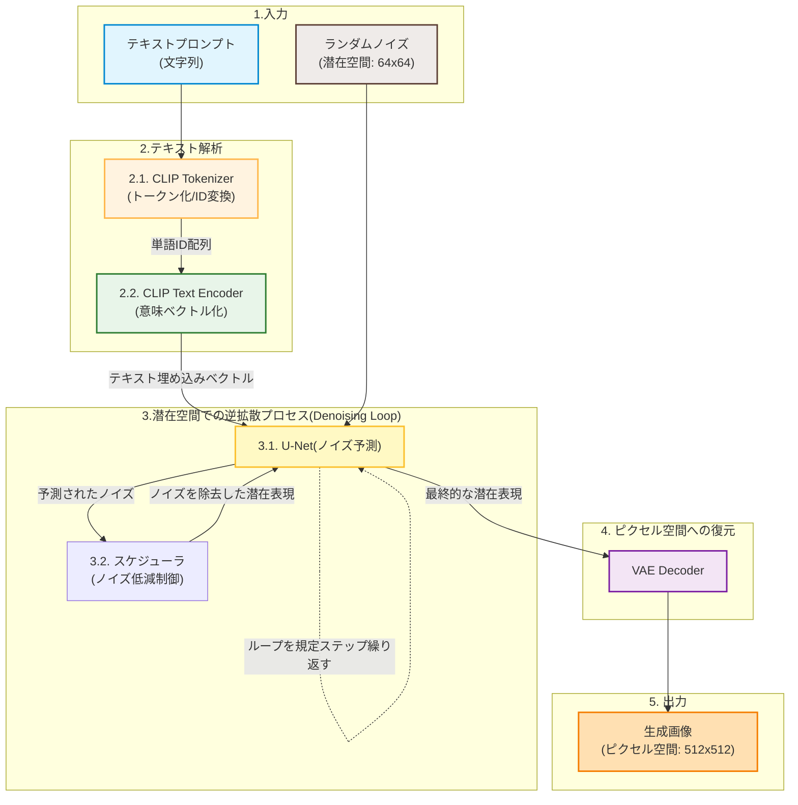

* **Kaggle実践2「Text-to-Image Generation Challenge」コンペ用にローカル検証環境を構築してみた** (本記事)

# アイキャッチ画像とキャプション
*テキスト → 画像生成*

# Abstruct
* 過去コンペ「Text-to-Image Generation Challenge」に参加
* ローカル検証環境を構築
* 一通り実行

# 概要
Kaggle Titanicを卒業して、次何やるかって考えた時に、「やっぱ次は画像系やろ!」って心の声に従って、このコンペ「Text-to-Image Generation Challenge」に挑戦することにしました。
このコンペの目標は、与えられたプロンプト(文字列) → いかに意図通りの画像を生成できるか(Prompt-to-Image Alignment)を競うものになってます。まさに最先端！ 生成AIのスキルを積むには格好のネタだろうと。
この記事では、ローカルPC上に画像生成と自動評価を行える検証環境を構築した手順と、その処理の中身の概要をまとめてみました。

# 環境構築の手順

## 1. マシン構成
検証環境として使用したローカルPCのスペックは以下の通りです。
* **OS**: Windows 11
* **CPU**: インテル Core プロセッサー（論理コア数24）
* **メモリ**: 32GB
* **GPU**: NVIDIA GeForce RTX 4060
* **ストレージ**: HDD（空き容量500GB）

## 2. インストールライブラリと選定理由
* **Python 3.12** ... 現在の最新は 3.14 ですが、3.14だと、PyTorch等のライブラリがGPUを使えんかった😞
* **uv** ... Python パッケージマネージャーです。
* **diffusers** ... Hugging Faceが提供する、Stable Diffusionなどの拡散モデルを動かすためのデファクトスタンダードライブラリ。
* **ultralytics(YOLO)** ... 生成された画像の中に、プロンプトで指示されたオブジェクトが正しく描かれているかを自動で検出・評価するために使用。

## 3. インストール手順

PowerShell で、下記コマンドを実行。

```powershell
# 1. uv のインストール
powershell -ExecutionPolicy ByPass -c "irm https://astral.sh/uv/install.ps1 | iex"

# 2. Python 3.12 を指定した仮想環境の作成
uv venv --python 3.12

# 3. CUDA 12.4 対応 of PyTorch および Torchvision を仮想環境にインストール
uv pip install torch torchvision --index-url https://download.pytorch.org/whl/cu124

# 4. 必要な依存ライブラリをまとめてインストール
uv pip install diffusers "transformers<5.0.0" accelerate pandas ultralytics
```

GPU（NVIDIA GeForce RTX 4060）で、CUDAを利用した高速な画像生成環境ができるようになりました。

# 一回通して実行してみた

一気通貫で動作するかを確認。
- プロンプトの読み込み → 画像生成 → 物体検出モデル(YOLO)による自動評価

```cmd
uv run src/baseline.py
```

# 処理フロー

### 1. 文字列から画像が生成される流れの解説

中心となるプロセス「文字列(プロンプト)から画像を生成する」は、内部的にどのような仕組みで動いていかというと、**Stable Diffusion** だと下記流れのようです。

#### 1.1 生成プロセスの全体像

Stable Diffusionは、**「潜在拡散モデル(Latent Diffusion Model: LDM)」** と呼ばれるアーキテクチャで動いています。高解像度のピクセル空間で直接計算を行うのではなく、より次元の低い「潜在空間(Latent Space)[^2]」に圧縮してノイズ除去[^3]を行うことで、メモリ消費量を抑えながら生成するという方法ですね。

[^2]: Q.そもそも潜在空間って何？ A.デジタル画像(ピクセル空間)は、例えば 512x512 の「ドット(点)の集まり」で、情報量が多すぎるので、ギュッと圧縮して、「ドットの並び」から「画像に何が描かれているかという特徴(輪郭、色合い、物体の意味など)」だけを抽出したデジタルデータに変換したデータを扱う空間のこと。<br/>

[^3]: Q.そもそも「ノイズ除去」って何？ U-Netが司る作業のこと。U-Netは「次に引くべき『無駄な砂嵐の成分』を予測して、引き算する」という作業をやってる。考え方は**「彫刻」**と同じ。<br/>



#### 各コンポーネントの役割

**1. 入力**
   * **テキストプロンプト（文字列）** ... 入力文字列。表示させたいものを羅列する。例: "A dog sitting on a chair(イスに座っている犬)" など。
<br/>
   * **ランダムノイズ(潜在空間: 64x64)** ... プログラムの実行時に、その場で自動生成している数値列。64x64の配列。

**2. テキスト解析**
   * **2.1. CLIP Tokenizer** ... 入力されたプロンプト（文字列）を単語やサブワードの最小単位(トークン)に切り分け、あらかじめ用意された単語辞書を元に「単語ID(数値の配列)」に変換します。
     * 例：`"A dog on a chair"` という文字列は、`[320, 2361, 803, 320, 8942]` のような数値配列になります。
<br/>
   * **C2.1. LIP Text Encoder** ... Tokenizerが生成した「単語IDの配列」を受け取り、単語同士の位置関係や意味のニュアンスを含んだ「意味を表す高次元ベクトル(Text Embeddings)」へと変換します。これが画像生成の「道標」となります。

**3. 潜在空間での逆拡散プロセス(Denoising Loop）**
逆拡散プロセスとは、「水に溶けたインクが、(時間を逆再生して)一滴のインクの塊に戻っていくプロセス」のイメージ。 完全な砂嵐(ノイズ)の状態からスタートして、「画像に混ざっているノイズ」をU-NetというAIを使って少しずつ予測し、引き算していき画像を完成させるプロセスのこと。

   * **3.1. U-Net(潜在空間でのノイズ予測)** ... 画像生成の開始時は、何の意味も持たないランダムなノイズ(Latent Noise)からスタートします。U-Netは、ノイズ画像とCLIPから送られてきたテキストベクトルを入力として受け取り、「プロンプトの意味に近づけるためには、現在の画像からどのノイズを取り除くべきか」を予測します。このテキストとノイズの紐付けには、**Cross-Attention(相互アテンション)** という仕組みが使われています。
<br/>
   * **3.2. スケジューラ(ノイズ低減の制御)** ... U-Netが予測したノイズを、どの程度の割合で引き算するかを制御するアルゴリズムです。「ノイズ予測 → ノイズ引き算」を何度もループ（Denoising Loop）することで、砂嵐のような状態から徐々に輪郭が浮かび上がり、最終的な画像の潜在表現が完成します。
    *※今回のベースラインで採用している `sd-turbo` は、このノイズ除去ステップを「わずか1ステップ」で終わらせることができる特殊な蒸留モデル（Adversarial Diffusion Distortion）であり、極めて高速に動作します。*

**4. ピクセル空間への復元**
   * **VAE Decoder** ... 潜在空間(通常は 64x64 などの小さなサイズ)で完成したノイズのないデータを、Variational Autoencoder(VAE) のデコーダーを通して、私たちが視覚的に認識できる解像度(512x512 などのピクセル画像)に復元・デコードします。

# 実装

今回の実行環境は、input: `DreamLayer-Prompt-Kaggle.txt`(Kaggleで提示) 、output: 画像、それを評価(YOLOv8を用いる)する内容になっています。

#### pythonコード

```python
import torch
import pandas as pd
import re
from pathlib import Path
from diffusers import StableDiffusionPipeline
from ultralytics import YOLO

# 共通のCOCOクラスに対応するオブジェクト
common_objects = {
    'man', 'woman', 'person', 'dog', 'cat', 'car', 'truck', 'train', 'airplane',
    'pizza', 'cake', 'donut', 'chair', 'table', 'bed', 'toilet', 'sink', 'mirror', 'clock', 'umbrella'
    # ... (一部省略)
}

def extract_expected_objects(text):
    words = re.findall(r'\b\w+\b', text.lower())
    return set(word for word in words if word in common_objects)

def calculate_f1_score(expected, detected):
    if len(expected) == 0 and len(detected) == 0:
        return 1.0
    if len(expected) == 0 or len(detected) == 0:
        return 0.0
    true_positives = len(expected.intersection(detected))
    precision = true_positives / len(detected)
    recall = true_positives / len(expected)
    if precision + recall == 0:
        return 0.0
    return 2 * (precision * recall) / (precision + recall)
```

画像生成処理では、再現性担保のために `torch.Generator` に固定シード値（`seed = 42`）を設定して画像を出力し、検出したスコアから `submission.csv` を生成します。


# 評価

## 実行結果とローカル評価スコア

ベースラインスクリプトを GPU（CUDA）上で実行した結果、以下の出力を得ました。

```text
Using device: cuda
Reading prompts from input\DreamLayer-Prompt-Kaggle.txt...
Loaded 49 prompts.
Loading pipeline for stabilityai/sd-turbo...
...
[49/49] Generating: 'A group of people standing on a snow covered hill.' -> 0049.png
Image generation complete.
Loading YOLOv8 model for local evaluation...
Running YOLO detection and F1 score calculation...
Saved results.csv to output\results.csv
Saved submission.csv to output\submission.csv

==================================================
LOCAL EVALUATION COMPLETE
Mean F1 Score: 0.5102
==================================================
```

高速な1ステップ生成モデルである `SD-Turbo` を用いた場合のローカル F1 スコアは **`0.5102`** となりました。

## 出力されたファイル群 (output/)
* `output/images/0001.png` 〜 `0049.png` (生成された画像)
* `output/results.csv` (プロンプト、検出オブジェクト、F1スコアの詳細ログ)
* `output/submission.csv` (Kaggle提出用CSV)
* `output/config-dreamlayer.json` (生成時のパラメータ設定)

スコア `0.5102`は、惨敗レベルってことですね。スタートしては悪くないみたいです。
ここから0.70を目指します。

# 今後の方針

ひとまずスコア `0.5102` を得られたため、これをベースに、さらに向上させていきます。

1. **高精度な生成モデルへの切り替え**:
   SD-Turbo は速度重視ですが、描写力（特に細かい物体の配置や形状）が甘いため、**SDXL (`stabilityai/stable-diffusion-xl-base-1.0`)** や **Flux** などのより表現力の高いモデルに変更。

2. **プロンプト調整 (Prompt Engineering)**:
   YOLOv8 が検出しやすいサイズや配置でターゲットオブジェクトが描かれるよう、プロンプトに品質ワードや強調表現をブレンド。

3. **セルフフィードバックイテレーション (最大化ハック)**:
   ローカル環境でシード値を変えて複数枚の画像を生成し、**「ローカルの YOLOv8 で最もF1スコアが高くなった画像」を自動選別して提出用画像とするシステム**を組む。これにより、評価器（YOLOv8）の特性に過学習（最適化）させた高スコアな提出用セットを作成可能。

次は、この「セルフフィードバック自動選別システム」の実装と、高画質モデルへの切り替えによるスコア変化を検証します。

# まとめ
今回は、Kaggle「Text-to-Image Generation Challenge」に向けて、ローカルPCに検証環境を構築し一通り実行。F1スコア `0.5102` 。
また、文字列から画像が生成される具体的なメカニズムについても理解を深めることができました。
ここからさらにモデルの選定やプロンプトハックを行い、スコアを伸ばしていきたいと思います。

お役に立てれば。
