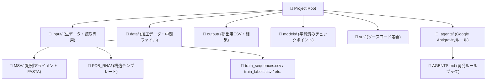
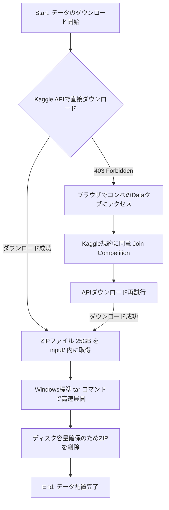

こんにちは。今回はKaggleの終了済みコンペティション「**Stanford RNA 3D Folding Part 2**」への取り組みを開始するにあたり、最初に行った環境構築、ディレクトリ設計、データのロード検証までのプロセスをまとめました。

同じように生命科学系のコンペに挑戦される方や、大規模データセットの初期セットアップ手順の参考になれば幸いです。

---

## 1. プロジェクトのディレクトリ設計

Kaggleなどの機械学習コンペでは、コードと大容量データ、そして学習済みモデルを綺麗に分けて管理することが再現性向上のために極めて重要です。
今回は以下のような構成でプロジェクトを設計しました。



- **`input/`** : Kaggle APIからダウンロードした生データを格納する領域です。Git管理からは除外されます。
- **`data/`** : 特徴量抽出などの前処理で生成した中間データを配置します。
- **`models/`** : 各種実験で学習させたチェックポイントファイル（`.pt` 等）を保存します。
- **`src/`** : モデルの定義や学習ループ等の共通コードをここに集約します。
- **`.agents/`** : 開発をサポートする自律型AIアシスタントに対するプロジェクト固有の指示書（`AGENTS.md`）を格納しています。

---

## 2. 環境構築と依存ライブラリの管理

本プロジェクトはPythonで実装します。将来的な環境の再現や別の計算リソース（GPUサーバーなど）への移行をスムーズにするため、`pyproject.toml` を使って依存ライブラリを一元管理しています。

### pyproject.toml の定義
作成した `pyproject.toml` は以下の通りです。

```toml
[project]
name = "stanford-rna-3d-folding-ii"
version = "0.1.0"
description = "Stanford RNA 3D Folding Part 2 Kaggle Competition"
readme = "README.md"
requires-python = ">=3.10"
dependencies = [
    "torch>=2.0.0",
    "lightning>=2.0.0",
    "numpy>=1.20.0",
    "pandas>=1.3.0",
    "scipy>=1.7.0",
    "scikit-learn>=1.0.0",
    "biopython>=1.80",
    "pyyaml>=6.0",
    "tqdm>=4.60.0",
    "matplotlib>=3.5.0",
    "seaborn>=0.11.0",
]
```

今回のターゲット環境である **Python 3.14.6** において、上記の構成から `pip install -e .` コマンドで正常に依存パッケージ群のインストールが完了しました。

---

## 3. Kaggleデータの取得フロー

本コンペティションの生データは約25GBと大容量です。また、コンペティションが既に終了（2026年3月終了）しているため、Kaggle APIからダウンロードする際に規約への同意処理でつまずきやすいという課題がありました。

今回は以下のフローに沿って無事にデータの配置を自動化しました。



### 実際のコマンド
1. **データの取得**:
   ```bash
   kaggle competitions download -c stanford-rna-3d-folding-2 -p input
   ```
2. **データの解凍**:
   Windows PowerShell環境では、標準の `Expand-Archive` よりも `tar` コマンドを使用する方が大容量ファイルの処理速度において圧倒的に有利です。
   ```bash
   tar -xf input/stanford-rna-3d-folding-2.zip -C input
   ```
3. **一時ファイルのクリーンアップ**:
   解凍後の容量圧迫を防ぐため、元のZIPファイルは直ちに削除しました。
   ```powershell
   Remove-Item input/stanford-rna-3d-folding-2.zip
   ```

---

## 4. データの動作確認と簡易構造分析

セットアップが完了した後、Pandasを使用してデータの簡易ロード確認を行いました。

### テストロード用スクリプト
```python
import pandas as pd
import os

input_dir = "input"

# 1. 配列データの読み込み
train_seq = pd.read_csv(os.path.join(input_dir, "train_sequences.csv"))
print(f"train_sequences shape: {train_seq.shape}")

# 2. 構造ラベルデータの読み込み（巨大なため先頭のみ）
train_labels = pd.read_csv(os.path.join(input_dir, "train_labels.csv"), nrows=100)
print(f"train_labels (first 100) shape: {train_labels.shape}")
```

### 出力結果とデータの特徴
実行した結果、以下の構造を持つデータが正常に取得できていることを確認しました。

```
train_sequences shape: (5716, 8)
  target_id  ...                   ligand_SMILES
0      4TNA  ...                          [Mg+2]
1      6TNA  ...                          [Mg+2]
...

train_labels (first 100 rows) shape: (100, 8)
       ID resname  resid    x_1    y_1     z_1 chain  copy
0  157D_1       C      1  4.843 -5.640  13.265     A     1
1  157D_2       G      2  3.385 -7.613   8.267     A     1
```

- **配列データ (`train_sequences.csv`)**: 5,716件のRNA配列データが含まれており、予測の鍵となる配列自体の他に、結合しているリガンド情報（`ligand_SMILES`）などの特徴量も含まれています。
- **構造データ (`train_labels.csv`)**: RNAを構成する各ヌクレオチド（`resname`、`resid`）ごとの3次元座標（`x_1`, `y_1`, `z_1`）が格納されています。

---

## まとめと次のステップ

初期環境構築とデータのロード検証が無事に完了しました。
次のステップでは、取得した3次元座標データの統計分析（Exploratory Data Analysis - EDA）を行うか、あるいは配列からC1'原子の座標をマッピングする簡易的なベースラインモデル（PyTorchベース）を構築して、学習とSubmissionのミニマムパイプラインを作成する予定です。
