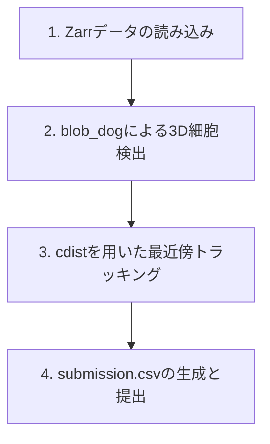

*アイキャッチ画像: 3D空間における細胞トラッキングの可視化イメージ*

### Abstruct
Kaggleの生物画像コンペティション「Biohub - Cell Tracking During Development」における、環境構築から3D細胞検出・トラッキングベースラインの構築、そしてKaggle APIによる初回提出(Submit)までの手順を分かりやすく解説します。

---

### 概要
生命科学分野において、発生過程(Development)における細胞の分裂や移動を正確に追跡(Tracking)することは、形態形成や遺伝子発現のダイナミクスを理解するために極めて重要です。本コンペティションでは、3D顕微鏡画像の時間変化データから細胞の位置(ノード)を検出し、フレーム間でそれらを結びつける(エッジ)タスクに挑みます。

データサイズが非常に大きいため、今回は無料のGPU枠が提供されているKaggle Notebooksをベースの開発環境として選定しました。ローカル環境はコードのバージョン管理や簡易的なデータ確認に使用し、実際の重い処理はクラウドで行うハイブリッド構成を採用します。

---

### 内容

#### 開発環境のセットアップと事前準備

本コンペティションに参加するには、いくつかの事前準備が必要です。

1. **コンペティション規約への同意**
   [Biohub - Cell Tracking During Development](https://www.kaggle.com/competitions/biohub-cell-tracking-during-development)のページにアクセスし、「Join Competition」ボタンを押して規約に同意します。これを行わないと、データのダウンロードや提出ができません。

2. **Kaggle APIトークンの取得**
   Kaggleアカウントの設定ページ(Settings)から「Create New Token」をクリックし、`kaggle.json`ファイルをダウンロードします。ローカル環境から提出する際や、CLIを使う際に必要となります。

```bash
# Kaggle APIトークンの配置(Linux/Macの場合)
mkdir -p ~/.kaggle
cp kaggle.json ~/.kaggle/
chmod 600 ~/.kaggle/kaggle.json
```

#### データの概要と読み込み

本コンペティションのデータは、OME-Zarrと呼ばれる、巨大な多次元バイナリデータを効率的に扱うためのフォーマットで提供されています。形状は基本的に(T,C,Z,Y,X)の5次元構造(T:時間, C:チャンネル, Z:深さ, Y:高さ, X:幅)となっています。

```python
import zarr
import numpy as np

# Zarrストアを開く
store = zarr.open("path_to_data.zarr", mode='r')
# 最高解像度の配列を取得
arr = store['0']
print(f"Data shape: {arr.shape}")
```

#### ベースラインパイプラインの構築

ベースラインモデルは、以下のシンプルな4つのステップで構築します。



##### 1. 3Dブロブ検出による細胞の位置特定

細胞の検出には、`scikit-image`ライブラリに用意されている `blob_dog`(Difference of Gaussians)アルゴリズムを使用します。この関数は3Dボリュームデータにも直接適用できます。

```python
from skimage.feature import blob_dog

def detect_cells_3d(image_3d, min_sigma=2, max_sigma=5, threshold=0.1):
    # image_3dは(Z,Y,X)の3次元配列
    blobs = blob_dog(image_3d, min_sigma=min_sigma, max_sigma=max_sigma, threshold=threshold)
    if len(blobs) > 0:
        return blobs[:, :3] # (z, y, x) 座標のみ抽出
    return np.empty((0, 3))
```

##### 2. 最近傍マッチングによる時間追跡(トラッキング)

時間軸(T)に沿って、前フレーム(T-1)で検出された細胞と現フレーム(T)で検出された細胞の距離を計算し、最も距離が近いペアを紐付けます(Greedyマッチング)。

```python
from scipy.spatial.distance import cdist

def track_frame_to_frame(coords_prev, coords_curr, max_distance=15.0):
    if len(coords_prev) == 0 or len(coords_curr) == 0:
        return []
    
    # 距離行列の計算
    dists = cdist(coords_prev, coords_curr)
    links = []
    used_curr = set()
    
    for i in range(len(coords_prev)):
        js = np.argsort(dists[i])
        for j in js:
            if j not in used_curr and dists[i, j] <= max_distance:
                links.append((i, j))
                used_curr.add(j)
                break
    return links
```

##### 3. 提出データの整形

コンペティションで指定されているCSVのスキーマに合わせて、検出した細胞(Node)と紐付け(Edge)の情報を格納します。

```python
import pandas as pd

# ノードとエッジのDataFrameを結合
df_nodes = pd.DataFrame(nodes)
df_edges = pd.DataFrame(edges)
df_sub = pd.concat([df_nodes, df_edges], ignore_index=True)

# id列(連番)を先頭に挿入
df_sub.insert(0, 'id', range(len(df_sub)))
df_sub.to_csv("submission.csv", index=False)
```

#### Kaggleへの初回提出

CSVファイルが生成されたら、Kaggle API(CLI)を使ってコマンドラインから素早く提出することができます。

```bash
kaggle competitions submit -c biohub-cell-tracking-during-development -f submission.csv -m "Baseline blob_dog detector and nearest neighbor tracker"
```

提出が成功すると、リーダーボードでスコアが反映されます。最初のスコアを確認し、ベースラインパイプラインが正しく動いているか検証しましょう。

---

### まとめ
OME-Zarr形式のデータ展開から、3D細胞検出、精度向上を模索する前に、まずは正常に提出が通ることを確認するためのベースラインパイプラインが完成しました。これをベースに、より高度な3D細胞検出モデル(CellposeやStarDistなど)の適用や、カルマンフィルター、ネットワークフローを用いたトラッキング手法の改善に進むことができます。

本記事が皆様のコンペ挑戦の第一歩として、少しでもお役に立てれば幸いです。
