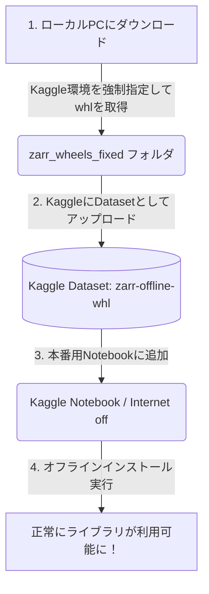

[](https://www.kaggle.com/competitions/biohub-cell-tracking-during-development)
*Biohub - Cell Tracking During Development*

## Abstruct
- (Kaggle用に)プリインストールされていない外部ライブラリのインストール手順のまとめ

## 概要
Kaggleのコードコンペティションって、Notebook提出のとき、インターネット接続不可でも動くのが条件になんですが、プリインストールされていない外部ライブラリ(例: `zarr`)だと、import エラーになります。かつ、コードの先頭で`!pip install zarr`ってやってもエラーになります。
その問題を安全かつ確実にオフラインインストールで解決する方法を解説します。

## 全体フロー
オフラインインストールまでの手順です。
まぁ早い話が、一回ローカルPCにDLしてそれをKaggleにupするってことですね。



## 手順

#### 1. ローカルPCでパッケージファイルをダウンロードする
コマンドプロンプト(cmd)で、以下コマンド実行。
`--python-version 3.12`(Kaggle環境（Linux/Python 3.12）を強制指定するオプション)を指定するのがポイント。

```batch
pip download zarr -d ./zarr_wheels_fixed --only-binary=:all: --platform manylinux2014_x86_64 --python-version 3.12 --implementation cp
```

これによって、指定したフォルダ内に `numcodecs` などの依存関係も含めた複数の `.whl` ファイルがダウンロードされます。
ダウンロード完了後、以下のコマンドでフォルダを開いておきます。

```cmd
start zarr_wheels_fixed
```

#### 2. Kaggleにデータセットとしてアップロードする
1. Kaggleの「Datasets」ページから **「New Dataset」** をクリックします。
2. タイトルを入力(例: `zarr-offline-whl`)します。
3. 先ほど開いたエクスプローラーから、ダウンロードしたファイルをすべてドラッグ&ドロップし、アップロードします。
4. アップロード完了後、**「Create」** を押してデータセットを作成します。

#### 3. ノートブックにマウントしてオフラインインストールを実行する
1. 本番用のノートブックの右側パネルで、**「Internet off」** に設定します。
2. **「+ Add Input」** をクリックし、作成したデータセットをノートブックに追加します。

以下の画像のように、ご自身のWorkから検索して追加します。


3. ノートブックの一番最初のセルで、以下のコマンドを実行します。

```python
!pip install --no-index --find-links=/kaggle/input/datasets/aaaa1597/zarr-offline-installation-wheels/zarr_wheels_fixed zarr
```
これで通信を行わずにローカルマウントされたパスから安全にインストールが完了します。

### まとめ
インターネットオフの制約があるコンペでも、この方法であれば、どんなライブラリでも自由に使用できます。

お役に立てれば。

※補足
`zarr`なら、Notebookの先頭に下記コードを埋めるだけで、インストールが成功しますよ。是非使ってください。
```python
!pip install --no-index --find-links=/kaggle/input/datasets/aaaa1597/zarr-offline-installation-wheels/zarr_wheels_fixed zarr
```
