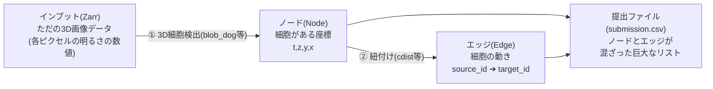
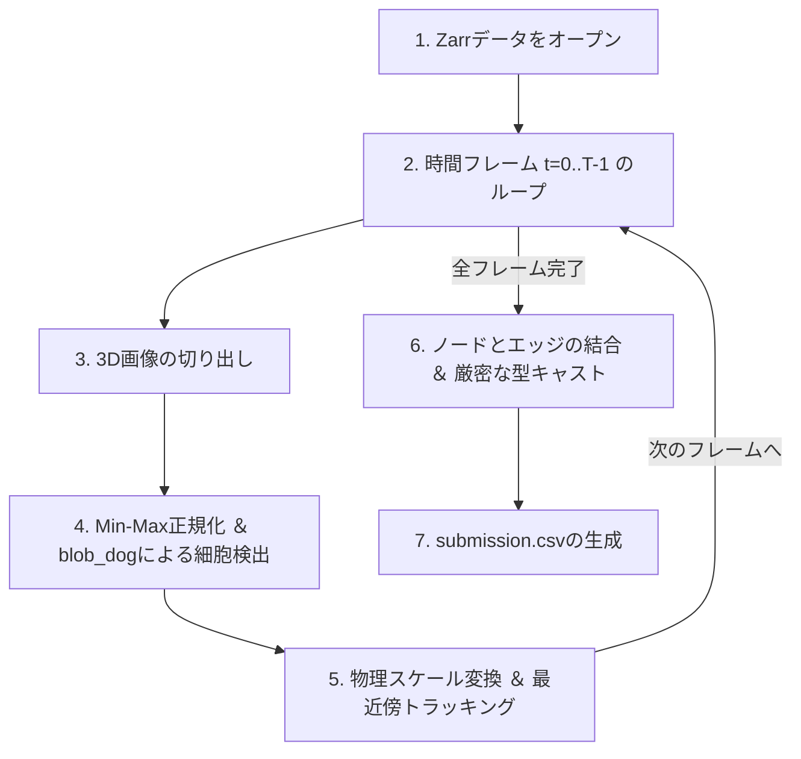

[18-①Kaggle実践3 Biohub細胞トラッキング：環境構築から初回提出までの手順](https://zenn.dev/rg687076/articles/zenn_20260714_0630_bct_environment_submission)
**18-②Kaggle実践3 Biohub細胞トラッキング：初回提出コードを解説してみた**(この記事)

[](https://www.kaggle.com/competitions/biohub-cell-tracking-during-development)
*Biohub - Cell Tracking During Development*

## Abstruct
- [前回記事](https://zenn.dev/rg687076/articles/zenn_20260714_0630_bct_environment_submission)で初回提出したコードの解説

## 概要
提出するだけでもムズくって、ひぃひぃ泣いてた。そのコード解説を載せてみた。

とはいえ実は機械学習を全くやってないシンプル構成。3D顕微鏡画像の時系列座標データから細胞の重心を検出 → 時間軸に沿って紐付けるという考え方を実行しているだけ。なのでスコアも控えめの0.505。

## インプットデータとZarrの仕組み

本コンペのデータ処理を理解する上で、そもそも「インプットデータがどのような構造をしているのか」そして「なぜZarrというフォーマットが使われているのか」を整理しておくことが極めて重要です。

### 1. インプットとアウトプットの整理

コンペのタスクは**「顕微鏡の3D動画データから、細胞の位置と動きを記録したCSVを作成する」**というものです。

* **インプット(Zarrデータ)**:
  `test/` ディレクトリ配下に `*.zarr` というフォルダ形式で格納されています。中身は胚の成長過程を撮影した3D動画で、各画素の明るさ(輝度値)の数値配列です。
* **アウトプット(submission.csv)**:
  画像から検出した「細胞の位置(ノード)」と、時間経過に伴う「細胞の繋がり(エッジ)」の情報を1つのリストにまとめて提出します。



### 2. Zarrの階層構造とメタデータファイルの役割

インプット`*.zarr` の実体は単一のファイルではなく、OS上では**「フォルダ(ディレクトリ)」**として存在します。その中身を覗くと、特徴的なメタデータファイルとデータフォルダによる階層構造になっています。

```tree
dataset.zarr/
├── .zgroup            # フォルダがグループ階層であることを示すメタデータファイル(JSON)
├── .zattrs            # 物理スケール情報やマルチスケール情報のメタデータファイル(JSON)
├── 0/                 # 最高解像度の3D+時間アレイ(store['0']の実体となるフォルダ)
│   ├── .zarray        # アレイの形状(T,C,Z,Y,X)や圧縮設定のメタデータファイル(JSON)
│   ├── 0.0.0.0.0      # チャンク(細切れデータの実体となるバイナリファイル)
│   ├── 0.0.0.0.1
│   └── ...
├── 1/                 # 1/2に縮小された解像度のアレイ
│   ├── .zarray
│   └── ...
└── labels/            # 細胞の正確な輪郭領域を示すラベル画像データ(グループ)
    ├── .zgroup
    └── 0/             # ラベルの最高解像度アレイ
```

フォルダの中にある **`.zgroup`**、**`.zattrs`**、**`.zarray`** はフォルダではなく、すべてドット `.` から始まる**JSON形式のテキストファイル**です。

* **`.zgroup`**: このディレクトリが他の配列やサブフォルダを内包する「グループ(階層)」であることを示します。これがあるおかげで、Pythonは `store['0']` や `store['labels']` のようなキーアクセスが可能になります。
* **`.zattrs`**: OME-Zarrの規格[^1]において、顕微鏡データの物理解像度(Z軸が 1.625 µm、XY軸が 0.40625 µm など)といったデータ独自の重要なメタデータを含みます。
* **`.zarray`**: 各アレイフォルダ(画像の実体が入った `0/` など)の直下に置かれ、配列の形状(Shape)やデータ型、圧縮方法、および「チャンク分割」のサイズが定義されています。

[^1]: **OME-Zarr（オーエムイー・ザール）**...生物顕微鏡画像データを保存・共有するために作られた「顕微鏡画像専用の次世代グローバル規格」。一言で言うと、「Zarrという『超巨大データを細切れにして保存する技術（空き箱）』の中に、『顕微鏡データならではの共通ルール（中身）』を詰め込んだもの」。<br/>**1. 開発の背景：顕微鏡データの課題**<br/>生物顕微鏡(特に3Dや時系列を撮る顕微鏡)のデータは、1回の撮影で数十ギガバイト〜数テラバイトに達するほど巨大で、「顕微鏡メーカー独自のバラバラな保存形式」や「巨大なTIFFファイル」で保存されていました。<br/>なので重すぎてファイルが開けない（全体をメモリにロードしようとしてPCがフリーズする）という問題がありました。<br/>ピクセルが物理的に何マイクロメートルなのかがデータ内に記録されていない、あるいはメーカーによって書き方がバラバラで、別の解析ソフトで開くとスケールが狂う<br/>この課題を解決するために、顕微鏡データの標準化を目指す国際コンソーシアム（学術団体）である OME（Open Microscopy Environment） が策定したのが「OME-Zarr」です。<br/>**2. OME-Zarrが定める「共通ルール」**<br/>通常のZarrはただの「多次元の数字の塊」ですが、OME-Zarrは設定ファイル（主に最上位の .zattrs）に、以下のような顕微鏡データ特有のルールを記述することを義務付けています。<br/>**① axes（軸の定義）**<br/>「このデータは5次元で、1番目は時間(T)、2番目はチャンネル(C)、3番目は奥行き(Z)である」ということをコンピュータが自動認識できるように定義します。<br/>**② coordinateTransformations（物理解像度）**<br/>「この画像の1ピクセルは、現実世界において Z方向は 1.625 µm、XY方向は 0.40625 µm に相当する」というカメラと顕微鏡の物理スケール（倍率）の情報を正確に記録します。 今回のベースラインコードで scale_zyx = np.array([1.625, 0.40625, 0.40625]) を掛けてトラッキングできたのは、この情報が規格として定義されていたからです。<br/>**③ multiscales（マルチスケール）**<br/>「全体の輪郭を見るための低解像度画像（1/ や 2/ フォルダ）」と、「細部を見るための最高解像度画像（0/ フォルダ）」が、それぞれどのくらいの比率で縮小されて格納されているかを記述します。

### 3. 「チャンク分割」とファイル名

Zarrの大きな特徴が、配列データを「チャンク」と呼ばれる小さなブロックに細切れにして、それぞれ別々のバイナリファイルとして保存している点です。
例えば、`.zarray` 内で以下のようなチャンクサイズが指定されているとします。
```json
"chunks": [1, 1, 30, 256, 256]
```
これは、5次元データ `(T, C, Z, Y, X)` を、時間1フレーム・チャンネル1・深さ30スライス・縦256ピクセル・横256ピクセルの単位で1つのファイルに区切るという意味です。
このため、画像フォルダの奥には **`0.0.0.0.0`** や **`1.0.0.0.0`** のような「ドット区切りの数値ファイル(拡張子なし)」が大量に並ぶことになります。この数値は各次元 `T.C.Z.Y.X` におけるチャンクのインデックスを指しています。
例えば、最初のチャンクファイルである **`0.0.0.0.0`** には、具体的に以下の範囲の画像データが丸ごと圧縮されて格納されています。
* `T` (時間): `t = 0` のみ(時間1フレーム分)
* `C` (チャンネル): `c = 0` のみ(チャンネル1分)
* `Z` (深さ): `z = 0〜29`(深さ30スライス分)
* `Y` (縦ピクセル): `y = 0〜255`(縦256ピクセル分)
* `X` (横ピクセル): `x = 0〜255`(横256ピクセル分)

※ プログラミングのインデックスは `0` から数え始める(0-indexed)ため、「30スライス」は `0〜29`、「256ピクセル」は `0〜255` の範囲になります。`0〜30` としてしまうと「31スライス分」になってしまうので注意が必要です。

同じように、Z方向の隣のチャンクである **`0.0.1.0.0`** には、`t = 0` / `c = 0` / `z = 30〜59` / `y = 0〜255` / `x = 0〜255` のデータが含まれ、時間方向の隣のチャンクである **`1.0.0.0.0`** には、`t = 1` / `c = 0` / `z = 0〜29` / `y = 0〜255` / `x = 0〜255` のデータが含まれる、という規則で細切れに保存されています。

* **なぜ時間(T)を `1` にするのか？**:
  時系列画像処理では、通常「1フレームずつロードして処理する」ため、時間軸のチャンクサイズを `1` にすることで、無駄なフレームの読み込みや解凍処理を発生させず、メモリ消費と処理時間を最小限に抑えています。

### 4. Zarrライブラリによるアクセスの「抽象化」
開発者は、接尾語`*.zarr`のフォルダや、.zgroup、.zattrsファイルを見て、**Zarrライブラリ(import zarr)で開くべきデータだ」**と理解する必要があります。それがエンジニアの力量ですね。

処理の開始時に、`store = zarr.open(zarr_path, mode='r')` と記述すると、ライブラリは裏側で自動的に以下の処理を行います。
1. `.zgroup` を読み込み、フォルダ全体をPythonの「ネストされた辞書」のようにアクセスできるオブジェクトに変換する。
2. `store['0']` でアクセスされた際に `0/` の `.zarray` をロードし、多次元の配列オブジェクトを生成する。
3. `store['0'][t, 0, :, :, :]` とスライスを指定された瞬間、対応するバイナリファイル(例: `0.0.0.0.0`)だけをピンポイントで読み込み、圧縮を解いてNumPy配列に変換してプログラムに渡す。

これで、巨大な配列でもシンプルなコードでデータにアクセスできるようになります。

## 処理フロー

全体の処理フローは以下のようになっています。



## 処理フローの各ステップの解説

### 1. Zarrストアをオープン

インプットである各 `*.zarr` フォルダのパスを指定してストアをオープンし、最高解像度の画像データが格納されているアレイ(`store['0']`)の参照を取得します。

前述の通り、この段階ではメタデータ(設計図)のみが読み込まれるため、画像データ本体はメモリ上にロードされず、メモリ消費量はほぼゼロです。

```python
# Zarrストアを開く(読み込み専用モード)
store = zarr.open(zarr_path, mode='r')

# 最高解像度のアレイ "0" を取得
arr = store['0']
```

### 2. 時間フレーム t=0..T-1 のループ

Zarrアレイの最初の次元である時間軸(T)のサイズを取得し、1フレームずつ時系列順に処理を進めるループを回します。

```python
# 形状の確認から総フレーム数(T)を取得
num_frames = arr.shape[0]

prev_nodes_info = []  # 前フレームのノード情報を保持するリスト

for t in tqdm(range(num_frames), desc="Frames"):
    # ループ内で各フレームの処理を実行
```

※ tqdmはループの進捗状況(プログレスバー)を画面上に表示するための便利なライブラリです。以下のような表示になります。便利～!
`Frames:  23%|███        | 23/100 [00:45<02:30,  1.95s/it]`

この表示から以下の情報が読み取れます:
- Frames: 自分が指定した説明テキスト(desc="Frames" の部分)
- 23%: 現在の進捗率
- 23/100: 全100フレームのうち、23フレーム目まで完了したこと
- [00:45<02:30]: これまでに45秒経過し、残り完了までにあと2分30秒かかるという予測値
- 1.95s/it: 1ループ(1フレームの処理)あたり1.95秒かかっているという処理速度

### 3. 3D画像の切り出し

現在処理中の時間フレーム `t` における3D画像スライスを切り出します。画像データの次元が5次元`(T, C, Z, Y, X)`であるか、4次元`(T, Z, Y, X)`であるかを判定した上で、適切にスライスを抽出します。
このスライス指定を行ったタイミングで、対応するチャンクバイナリファイル(例: `0.0.0.0.0`)だけが裏でロード・展開され、メモリに載る仕組みになっています。

```python
# 形状 of the (T, C, Z, Y, X) または (T, Z, Y, X)
has_channels = (arr.ndim == 5)

# 3D画像の切り出し
if has_channels:
    img_3d = arr[t, 0, :, :, :]
else:
    img_3d = arr[t, :, :, :]
```

### 4. Min-Max正規化 ＆ blob_dogによる細胞検出

切り出した3D画像スライスのコントラストを最大化するために、フレームごとにMin-Max正規化(0.0〜1.0へのスケール変換)を行います。その後、`scikit-image` の `blob_dog` アルゴリズムを適用し、細胞の重心ピクセル座標を取得します。
もし検出された細胞数が0件だった場合、デバッグを容易にするために画像の統計情報(最小値、最大値、平均値)を出力する警告ログを仕込んでいます。

```python
def detect_cells_3d(image_3d, min_sigma=2, max_sigma=5, threshold=0.05):
    """3D画像から細胞の重心(Z,Y,X)を検出します。"""
    img_min = image_3d.min()
    img_max = image_3d.max()
    if img_max > img_min:
        img_norm = (image_3d.astype(np.float32) - img_min) / (img_max - img_min)
    else:
        img_norm = np.zeros_like(image_3d, dtype=np.float32)
        
    blobs = blob_dog(img_norm, min_sigma=min_sigma, max_sigma=max_sigma, threshold=threshold)
    
    if len(blobs) > 0:
        return blobs[:, :3]
        # NumPyのスライス機能で、
        # :  行は「すべて」選択する
        # :3 列は「0番目から2番目まで（3の手前まで）」選択する。つまり z, y, x のみを取り出す。
    return np.empty((0, 3))
    # 「行数は0行だが、列数は3列ある」という「空（から）のNumPy配列」が返る。
```
※blob_dog() ... 画像の中から**「周囲よりも明るい（または暗い）球状の斑点（Blob）」を検出するアルゴリズム**です。さらなる詳細説明は[^2]参照

[^2]: <br/>DoG は Difference of Gaussians（ガウス関数の差分） の略で、一言で言うと 「ぼかし具合の異なる2つの画像を引き算することで、特定の大きさの丸い細胞だけを浮かび上がらせる技術」です。具体的には、裏側で以下の3つのステップを実行しています。<br/>仕組みの3ステップ<br/>**ステップ1：ぼかし方の違う2つの画像を作る**<br/>入力された3D画像に対して、ガウシアンフィルターという「ぼかし処理」を2回行います。<br/><br/>画像A：少しだけぼかした画像（細胞のざらざらした細かいノイズが消える）<br/>画像B：もっと強くぼかした画像（細胞そのものも背景に溶け込んでぼやける）<br/><br/>**ステップ2：2つの画像を引き算する（差分を取る）**<br/>少しだけぼかした画像Aから、強くぼかした画像Bを引き算（A - B）します。<br/>これをやると魔法のようなことが起きます。<br/><br/>画像全体に広がる「うっすらとした明るさのムラ（低周波成分）」が引き算で綺麗に相殺されます。<br/>同時に、顕微鏡カメラの「細かなノイズ（高周波成分）」もステップ1のぼかしで消えています。<br/>結果として、「特定の大きさ（半径）を持った丸い細胞の領域」だけが、背景からくっきりと白く浮かび上がった差分画像が出来上がります。<br/>**ステップ3：最も明るい「中心点」を探す**<br/>浮かび上がった差分画像の中で、周囲に比べて輝度がピーク（極大値）になっているピクセル座標を探し出します。そこが「細胞の中心（重心）」になります。<br/><br/>主要なパラメータの意味<br/>コード内で指定しているパラメータは、この「ぼかしのサイズ」を調整するためのものです。<br/>min_sigma=2（最小シグマ）:ぼかしの最小半径です。これより小さな（例えばノイズのような）極小の斑点は無視します。<br/>max_sigma=5（最大シグマ）:ぼかしの最大半径です。これより大きな（例えば巨大な背景の光の塊のような）斑点は無視します。<br/>※ この min_sigma から max_sigma の間の大きさを持った細胞だけがターゲットになります。<br/>threshold=0.05（閾値）:斑点の「くっきり度合い（コントラスト強度）」の最低ラインです。これよりぼんやりした（暗い）斑点は、細胞ではないとみなして切り捨てます。<br/><br/>なぜ顕微鏡画像（細胞）に最適なのか？<br/>顕微鏡で撮影した細胞の核は、写真上では**「中心が明るく、外側に向かってなだらかに暗くなる球体」**として写ります。<br/>blob_dog() はまさにこの「なだらかな球体」を見つけ出すのが最も得意なアルゴリズムであるため、ベースラインの細胞検出手法として非常によく使われています。<br/>

### 5. 物理スケール変換 ＆ 最近傍トラッキング

顕微鏡データはZ軸とXY軸の物理的なピクセルピッチ(解像度)が異なる異方性データです。そのため、ピクセル座標のままで距離を計算すると、Z方向の動きが歪んで評価されてしまいます。
そこで、検出されたピクセル座標に `scale_zyx = np.array([1.625, 0.40625, 0.40625])` を乗算して物理座標(µm)に変換し、正しいユークリッド距離に基づいてフレーム間のトラッキング(Greedyマッチング)を行います。(.zattrsに定義)

```python
# 物理スケール(µm)に変換してトラッキング距離を計算 (Z: 1.625, Y: 0.40625, X: 0.40625)
scale_zyx = np.array([1.625, 0.40625, 0.40625])
coords_prev_physical = coords_prev * scale_zyx
coords_curr_physical = coords_curr * scale_zyx

# 物理空間上で最大距離 15.0 µm 以内にある最近傍ノード同士を結ぶ
links = track_frame_to_frame(coords_prev_physical, coords_curr_physical, max_distance=15.0)
```

### 6. ノードとエッジの結合 ＆ 厳密な型キャスト

すべてのフレーム処理が完了したら、収集されたノード(Node)リストとエッジ(Edge)リストを別々の DataFrame に変換し、縦方向に結合します。
Kaggleの提出時に、一時的な float 型の混入や NaN などの欠損値判定によってカラムのデータ型が狂うと、提出時に「Submission Error」で即失格になります。これを防ぐために、最後にすべてのカラムを `int64` に明示的かつ厳密にキャストします。

```python
# ノードとエッジのDataFrameを結合
df_sub = pd.concat([df_nodes, df_edges], ignore_index=True)

# 先頭にid列(連番)を追加
df_sub.insert(0, 'id', range(len(df_sub)))

# データ型を明示的にキャスト (全てをint型にする)
df_sub = df_sub.astype({
    'id': 'int64',
    'node_id': 'int64',
    't': 'int64',
    'z': 'int64',
    'y': 'int64',
    'x': 'int64',
    'source_id': 'int64',
    'target_id': 'int64'
})
```

### 7. submission.csvの生成

厳密な型キャストが施された DataFrame を CSV 形式で出力します。保存の際にはインデックスが出力されないよう `index=False` を指定します。

```python
# submission.csv として保存
df_sub.to_csv("submission.csv", index=False)
```

処理フローの各ステップの解説は終わりです。

## ソースコード全体
ソースコード全体を載せますね。スコアは0.505です。
ここから猛烈な修正が必要です。

```python
!pip install --no-index --find-links=/kaggle/input/datasets/aaaa1597/zarr-offline-installation-wheels/zarr_wheels zarr

import os
import glob
import zarr
import numpy as np
import pandas as pd
from skimage.feature import blob_dog
from scipy.spatial.distance import cdist
import matplotlib.pyplot as plt
from tqdm import tqdm

###########################################
# 1. Setup and Data Path Verification
# 1. 設定とデータパスの確認
# Set up the input data paths in the Kaggle environment. 
# Kaggle環境でのテスト用データセットのパスを設定。

# Candidate input data paths in Kaggle
# Kaggleでの入力データパスの候補
CANDIDATES = [
    "/kaggle/input/biohub-cell-tracking-during-development",
    "/kaggle/input/competitions/biohub-cell-tracking-during-development",
]

ROOT = "/kaggle/input/biohub-cell-tracking-during-development"
for p in CANDIDATES:
    if os.path.exists(os.path.join(p, "test")):
        ROOT = p
        break

TEST_DIR = os.path.join(ROOT, "test")
print(f"Using TEST_DIR: {TEST_DIR}")

# Get the list of Zarr folders in the test dataset
# テストデータセット of the Zarr folders
test_zarr_paths = glob.glob(os.path.join(TEST_DIR, "*.zarr"))
print(f"Found {len(test_zarr_paths)} test datasets.")
for p in test_zarr_paths:
    print(f"  {os.path.basename(p)}")
     

###########################################
# 2. 3D Blob Detection and Tracking Implementation
# 2. 3Dブロブ検出とトラッキングの実装
# Detect cells in each time frame and track them between adjacent frames. 
# 各タイムフレームで細胞を検出し、隣接フレーム間でトラッキングを行います。

def detect_cells_3d(image_3d, min_sigma=2, max_sigma=5, threshold=0.05):
    """Detect cell centroids (Z,Y,X) from a 3D image.
    3D画像から細胞の重心(Z,Y,X)を検出します。
    """
    # Min-Max normalize the image to 0.0-1.0 to maximize contrast
    # 画像を 0.0〜1.0 にMin-Max正規化してコントラストを最大化します
    img_min = image_3d.min()
    img_max = image_3d.max()
    if img_max > img_min:
        img_norm = (image_3d.astype(np.float32) - img_min) / (img_max - img_min)
    else:
        img_norm = np.zeros_like(image_3d, dtype=np.float32)
        
    # Run blob_dog on the normalized image
    # 正規化画像に対して blob_dog を実行
    blobs = blob_dog(img_norm, min_sigma=min_sigma, max_sigma=max_sigma, threshold=threshold)
    # Since blobs returns an array of (z, y, x, sigma), extract coordinates only
    # blobsは (z, y, x, sigma) の配列を返すため、座標のみ抽出
    if len(blobs) > 0:
        return blobs[:, :3]
    return np.empty((0, 3))
     

def track_frame_to_frame(coords_prev, coords_curr, max_distance=15.0):
    """Perform nearest neighbor matching between adjacent frames.
    隣接するフレーム間で最近傍マッチングを行います。
    Returns: List of (prev_index, curr_index) pairs
    戻り値: (prev_index, curr_index) のペアリスト
    """
    if len(coords_prev) == 0 or len(coords_curr) == 0:
        return []
    
    # Compute distance matrix
    # 距離行列を計算
    dists = cdist(coords_prev, coords_curr)
    
    links = []
    # Simple nearest neighbor matching using a greedy method
    # シンプルな貪欲法(Greedy)による最近傍マッチング
    # For more robust matching, algorithms like the Hungarian method can be used
    # より堅牢にするにはハンガリアン法等を使用できます
    used_curr = set()
    for i in range(len(coords_prev)):
        js = np.argsort(dists[i])
        for j in js:
            if j not in used_curr and dists[i, j] <= max_distance:
                links.append((i, j))
                used_curr.add(j)
                break
    return links
     

###########################################
# 3. Pipeline Execution
# 3. メイン処理実行
# Loop through all test datasets to collect node and edge information.
# すべてのテストデータセットに対して処理をループ実行し、ノードとエッジの情報を収集します。

nodes = []
edges = []

print(f"Processing {len(test_zarr_paths)} datasets.")
for zarr_path in test_zarr_paths:
    dataset_name = os.path.basename(zarr_path).replace(".zarr", "")
    print(f"Processing dataset: {dataset_name}")
    
    # Reset node ID from 1 for each dataset
    # 各データセットごとにノードIDを1からリセット
    node_counter = 1
    
    # Open Zarr store
    # Zarrストアを開く
    store = zarr.open(zarr_path, mode='r')
    # Get the highest resolution array "0"
    # 最高解像度の配列 "0" を取得
    arr = store['0']
    
    # Check shape (T, C, Z, Y, X) or (T, Z, Y, X)
    # 形状の確認 (T, C, Z, Y, X) または (T, Z, Y, X)
    has_channels = (arr.ndim == 5)
    num_frames = arr.shape[0]
    
    prev_nodes_info = []  # Node info of the previous frame / 前フレームのノード情報
    
    for t in tqdm(range(num_frames), desc="Frames"):
        # Slice 3D image
        # 3D画像の切り出し
        if has_channels:
            img_3d = arr[t, 0, :, :, :]
        else:
            img_3d = arr[t, :, :, :]
            
        # 3D cell detection
        # 3D細胞検出
        coords = detect_cells_3d(img_3d, min_sigma=2, max_sigma=5, threshold=0.05)
        
        # [Warning Log] When detected cells count is 0 (can happen in actual microscope data due to out-of-field or dark environments)
        # 【警告ログ】細胞検出数が0個の場合 (実際の顕微鏡データでは視野外や暗室などの理由で0件になり得ます)
        if len(coords) == 0:
            min_val = np.min(img_3d)
            max_val = np.max(img_3d)
            mean_val = np.mean(img_3d)
            print(f"Warning: 0 cells detected in dataset '{dataset_name}' at frame {t}. "
                  f"Image Stats -> Min: {min_val}, Max: {max_val}, Mean: {mean_val:.4f}")
        
        curr_nodes_info = []
        # Create node rows
        # ノード行の作成
        for idx, (z, y, x) in enumerate(coords):
            node_id = node_counter
            node_counter += 1
            
            nodes.append({
                "dataset": dataset_name,
                "row_type": "node",
                "node_id": int(node_id),
                "t": int(t),
                "z": int(round(z)),
                "y": int(round(y)),
                "x": int(round(x)),
                "source_id": -1,
                "target_id": -1
            })
            curr_nodes_info.append((idx, node_id, (z, y, x)))
            
        # Create edge rows (tracking)
        # エッジ行の作成(トラッキング)
        if len(prev_nodes_info) > 0 and len(curr_nodes_info) > 0:
            coords_prev = np.array([item[2] for item in prev_nodes_info])
            coords_curr = np.array([item[2] for item in curr_nodes_info])
            
            # Convert to physical scale (micrometers) and compute tracking distance
            # 物理スケール(µm)に変換してトラッキング距離を計算 (Z: 1.625, Y: 0.40625, X: 0.40625)
            scale_zyx = np.array([1.625, 0.40625, 0.40625])
            coords_prev_physical = coords_prev * scale_zyx
            coords_curr_physical = coords_curr * scale_zyx
            
            links = track_frame_to_frame(coords_prev_physical, coords_curr_physical, max_distance=15.0)
            
            # [Warning Log] When connected edges count is 0 (can happen due to sudden cell movement or microscope drift)
            # 【警告ログ】接続が0個の場合 (細胞の急激な移動や顕微鏡のドリフトで0件になり得ます)
            if len(links) == 0:
                print(f"Warning: 0 tracking edges created between frame {t-1} and {t} in dataset '{dataset_name}'. "
                      f"Previous node count: {len(prev_nodes_info)}, Current node count: {len(curr_nodes_info)}.")
            
            for idx_prev, idx_curr in links:
                src_id = prev_nodes_info[idx_prev][1]
                tgt_id = curr_nodes_info[idx_curr][1]
                
                edges.append({
                    "dataset": dataset_name,
                    "row_type": "edge",
                    "node_id": -1,
                    "t": -1,
                    "z": -1,
                    "y": -1,
                    "x": -1,
                    "source_id": int(src_id),
                    "target_id": int(tgt_id)
                })
                
        prev_nodes_info = curr_nodes_info
     

###########################################
# 4. Submission File Generation and Verification
# 4. 提出ファイルの生成と確認
# Merge nodes and edges and output to CSV in the specified format.
# ノードとエッジをマージして所定のフォーマットでCSVに出力します。

# Convert to DataFrame
# DataFrameに変換
columns_order = ["dataset", "row_type", "node_id", "t", "z", "y", "x", "source_id", "target_id"]

if len(nodes) == 0:
    df_nodes = pd.DataFrame(columns=columns_order)
else:
    df_nodes = pd.DataFrame(nodes)

if len(edges) == 0:
    df_edges = pd.DataFrame(columns=columns_order)
else:
    df_edges = pd.DataFrame(edges)

df_sub = pd.concat([df_nodes, df_edges], ignore_index=True)

# Add id column (sequential index) at the beginning
# id列(連番インデックス)を最初に追加
df_sub.insert(0, 'id', range(len(df_sub)))

# Reorder columns and check data types
# カラム順序の整理とデータ型の確認
df_sub = df_sub[["id"] + columns_order]

# Explicitly cast data types (convert all to int)
# データ型を明示的にキャスト (全てをint型にする)
df_sub = df_sub.astype({
    'id': 'int64',
    'node_id': 'int64',
    't': 'int64',
    'z': 'int64',
    'y': 'int64',
    'x': 'int64',
    'source_id': 'int64',
    'target_id': 'int64'
})

# Preview display
# プレビュー表示
print(f"Total rows: {len(df_sub)}")
print(df_sub.head())
print(df_sub.tail())

# Save
# 保存
df_sub.to_csv("submission.csv", index=False)
print("submission.csv has been successfully generated!")
```

## まとめ

本記事では、[この記事](https://zenn.dev/rg687076/articles/zenn_20260714_0630_bct_environment_submission)で初回提出した、Kaggle「Biohub細胞トラッキング」コンペのコードを細かく解説しました。

シンプルなベースラインではありますが、以下のポイントが実装されています。
- オフライン環境でのパッケージインストール
- 暗い画像にも強いMin-Max正規化を施した3D細胞検出
- 縦横のピクセル比率の歪みを補正する物理スケール変換でのトラッキング
- 提出仕様に準拠させるための厳密な型キャスト

まずはこのベースラインを元に、今後は3D細胞検出器をより高度なモデル(CellposeやStarDistなど)へ差し替えたり、トラッキングの最適化手法を改善していく予定です。

お役に立てれば。
