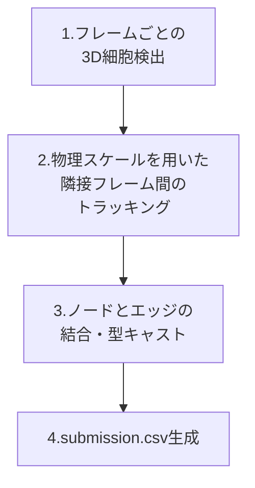

[18-①Kaggle実践3 Biohub細胞トラッキング：環境構築から初回提出までの手順](https://zenn.dev/rg687076/articles/zenn_20260714_0630_bct_environment_submission)
**18-②Kaggle実践3 Biohub細胞トラッキング：初回提出コードを解説してみた**(この記事)


[](https://www.kaggle.com/competitions/biohub-cell-tracking-during-development)
*Biohub - Cell Tracking During Development*

## Abstruct
- この[記事](https://zenn.dev/rg687076/articles/zenn_20260714_0630_bct_environment_submission)で扱った、初回提出コードの解説

## 概要
提出するだけでもムズくって、ひぃひぃ泣いてた。
そのコード解説を載せてみた。

とはいえ実は機械学習を全くやってないシンプル構成。
3D顕微鏡画像の時系列座標データから細胞の重心を検出 → 時間軸に沿って紐付けるという考え方。
なのでスコアも控えめの0.505。

## 処理フロー

全体の処理フローは以下のようになっています。



## ソースコード全体
初回提出コードは下記です。スコア0.505ですね。
@[gist](https://gist.github.com/kito2718/2bbb9dec9908464191eb008643fc33c8)

### 0. セットアップとオフラインインストール

Kaggleの提出用Notebookは、インターネット接続オフ(Offline)の環境で動作させる必要があります。そのため、標準でインストールされていない `zarr` ライブラリをオフラインでインストールする必要があります。

```python
# Kaggle環境(インターネットOFF)でプリセット外ライブラリをインストール
!pip install --no-index --find-links=/kaggle/input/datasets/aaaa1597/zarr-offline-installation-wheels/zarr_wheels zarr
```
上記コマンドでインストールが成功します。

次に、必要なライブラリのインポートと、テストデータのパス確認を行います。テストデータが配置されるパスは環境によって異なる場合があるため、複数の候補から動的に探索します。

```python
import os
import glob
import zarr
import numpy as np
import pandas as pd
from skimage.feature import blob_dog
from scipy.spatial.distance import cdist
from tqdm import tqdm

# Kaggleでの入力データパスの候補
CANDIDATES = [
    "/kaggle/input/biohub-cell-tracking-during-development",
    "/kaggle/input/competitions/biohub-cell-tracking-during-development",
]

ROOT = "/kaggle/input/biohub-cell-tracking-during-development"
for p in CANDIDATES:
    if os.path.exists(os.path.join(p, "test")):
        ROOT = p
        break

TEST_DIR = os.path.join(ROOT, "test")
test_zarr_paths = glob.glob(os.path.join(TEST_DIR, "*.zarr"))
```

### 2. 3D細胞検出(detect_cells_3d)

顕微鏡データから細胞の重心を検出するために、`scikit-image` の `blob_dog`(Difference of Gaussians)を使用します。

```python
def detect_cells_3d(image_3d, min_sigma=2, max_sigma=5, threshold=0.05):
    """3D画像から細胞の重心(Z,Y,X)を検出します。"""
    # コントラストを最大化するために画像を0.0〜1.0にMin-Max規格化
    img_min = image_3d.min()
    img_max = image_3d.max()
    if img_max > img_min:
        img_norm = (image_3d.astype(np.float32) - img_min) / (img_max - img_min)
    else:
        img_norm = np.zeros_like(image_3d, dtype=np.float32)
        
    # 規格化画像に対して blob_dog を実行
    blobs = blob_dog(img_norm, min_sigma=min_sigma, max_sigma=max_sigma, threshold=threshold)
    
    # blobsは (z, y, x, sigma) の配列を返すため、座標のみ抽出
    if len(blobs) > 0:
        return blobs[:, :3]
    return np.empty((0, 3))
```

#### 実装のポイント：Min-Max正規化
3Dの顕微鏡画像は、画像全体の明るさにばらつきがあったり、全体的に暗い場合があります。これをそのまま検出器に渡すと閾値の判定がうまく機能しません。そこで、フレームごとに `Min-Max規格化` を行い、コントラストを最大化(0.0〜1.0)させてから検出に回すことで、安定した検出精度を確保しています。

また、画像内に細胞が1つも検出されなかった場合、デバッグ用に画像の統計情報(最小値、最大値、平均値)を出力するログをループ内に仕込んでいます。これにより、データがおかしいのか検出の閾値が厳しすぎるのかを素早く判断できます。

### 3. 物理スケールを考慮したトラッキング

検出した細胞の位置をフレーム間で紐付ける(トラッキング)ために、最近傍探索を行います。

ここで非常に重要なのが、**ピクセル座標を物理スケール(マイクロメートル)に変換する**という処理です。

```python
# 物理スケール(µm)への変換ベクトル (Z: 1.625, Y: 0.40625, X: 0.40625)
scale_zyx = np.array([1.625, 0.40625, 0.40625])
coords_prev_physical = coords_prev * scale_zyx
coords_curr_physical = coords_curr * scale_zyx

links = track_frame_to_frame(coords_prev_physical, coords_curr_physical, max_distance=15.0)
```

#### なぜ物理スケール変換が必要なのか？
顕微鏡画像は、Z方向のスライス間隔とXY方向のピクセルピッチが異なります。今回のデータでは、**Z方向の間隔は 1.625 µm** であるのに対し、**XY方向の解像度は 0.40625 µm** です。

Z方向はXY方向に比べて**約4倍**も粗いのです。

これをピクセル座標のままユークリッド距離を計算してしまうと、Z方向の「1ピクセルの移動」とXY方向の「1ピクセルの移動」が同じ距離として扱われてしまい、Z方向の動きが過小評価されてしまいます。したがって、物理空間(µm)に変換した座標を用いて距離を計算し、マッチングの閾値(`max_distance=15.0` µm)を適用する必要があります。

#### トラッキングコード(最近傍マッチング)
トラッキング自体は、`scipy.spatial.distance.cdist` で距離行列を作成し、最も近い細胞同士を紐付ける貪欲法(Greedy)を採用しています。

```python
def track_frame_to_frame(coords_prev, coords_curr, max_distance=15.0):
    """隣接するフレーム間で最近傍マッチングを行います。"""
    if len(coords_prev) == 0 or len(coords_curr) == 0:
        return []
    
    # 距離行列の計算
    dists = cdist(coords_prev, coords_curr)
    
    links = []
    used_curr = set()
    for i in range(len(coords_prev)):
        js = np.argsort(dists[i])
        for j in js:
            if j not in used_curr and dists[i, j] <= max_distance:
                links.append((i, j))
                used_curr.add(j)
                break
    return links
```

### 4. 提出データの整形とフォールバック

検出した細胞(Node)と紐付け(Edge)の情報を結合し、提出用のCSVフォーマットを作成します。

```python
# DataFrameに結合
df_sub = pd.concat([df_nodes, df_edges], ignore_index=True)

# 先頭にid列(連番インデックス)を挿入
df_sub.insert(0, 'id', range(len(df_sub)))

# 明示的にデータ型をキャスト (すべてint型にする)
df_sub = df_sub.astype({
    'id': 'int64',
    'node_id': 'int64',
    't': 'int64',
    'z': 'int64',
    'y': 'int64',
    'x': 'int64',
    'source_id': 'int64',
    'target_id': 'int64'
})

df_sub.to_csv("submission.csv", index=False)
```

#### 実装 of the points：型キャストとモックフォールバック
提出用データは、IDや座標などのほとんどの数値データが整数値(Integer)である必要があります。Pandasで結合(concat)した際、欠損値(NaN)や一時的な浮動小数点型(float)が混入してデータ型が狂うと、提出時に**「Submission Error」**で即失格になります。これを防ぐために、最後にすべてのカラムに対して明示的な `astype({'column': 'int64'})` キャストを実行しています。

また、Kaggleのテスト環境では、Notebookを保存する際(Save Version)にテストデータが見えない状態、あるいはテストデータが空の状態で実行されるケースがあります。テストデータ数が0個のときに例外で落ちてしまうとNotebookの保存が完了しません。そのため、テストデータが取得できなかった場合は、ダミーのノード(mock)を1行出力するフォールバック処理を実装し、必ずNotebookの `Run All` が通るように工夫しています。

## まとめ

本記事では、Kaggle「Biohub細胞トラッキング」コンペの初回提出コードを細かく解説しました。

シンプルなベースラインではありますが、以下のポイントが実装されています。
- オフライン環境でのパッケージインストール
- 暗い画像にも強いMin-Max正規化を施した3D細胞検出
- 縦横のピクセル比率の歪みを補正する物理スケール変換でのトラッキング
- 提出仕様に準拠させるための厳密な型キャストとエラー回避用のモック生成

まずはこのベースラインを元に、今後は3D細胞検出器をより高度なモデル(CellposeやStarDistなど)へ差し替えたり、トラッキングの最適化手法を改善していく予定です。

お役に立てれば。
