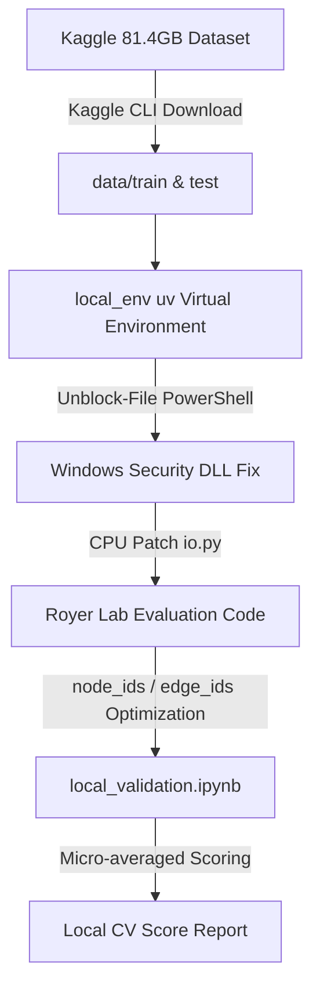

[18-①Kaggle実践3 Biohub細胞トラッキング：環境構築から初回提出までの手順](https://zenn.dev/rg687076/articles/zenn_20260714_0630_bct_environment_submission)
[18-②Kaggle実践3 Biohub細胞トラッキング：初回提出コードを解説してみた](https://zenn.dev/rg687076/articles/zenn_20260717_1930_bct_code_explanation)
**18-③Kaggle実践3 Biohub細胞トラッキング：ローカル環境を構築してみた(交差検証(CV)込み)**(この記事)

[](https://www.kaggle.com/competitions/biohub-cell-tracking-during-development)
*Biohub - Cell Tracking During Development*

## Abstract
- Kaggle「Biohub - Cell Tracking During Development」コンペ向けのローカル環境構築手順
- windows 11

## 概要
このコンペ、入力が81.4GBデータセットでデカいのでKaggle提出するたびに実行・保存・提出が動作して結構な時間がかかります。結構めんどい。なのでローカルPCで評価環境を構築してみた。
もうね、提出手順の「Run All」→「Save Version」→「Submit to Competition」がめんどいんですよ。

なので、構築の手順(全199胚データセットに対する評価を実施する環境)をまとめてみた。

## 構築手順
### 1. 構築フロー
構築フローは以下の通り


### 2. ディレクトリ構成
仮想環境、データセット、評価リポジトリ、Notebookを1つの親フォルダ`local_env`に構築。

```text
プロジェクトフォルダ/
├── local_env/                                  <- uvで作成したPython仮想環境
│   ├── Scripts/python.exe                      <- VS Code等のJupyterで指定するPythonパス
│   ├── data/                                   <- ダウンロード済みの全データ(81.4 GB)
│   │    ├── train/
│   │    └── test/
│   ├── src/
│   │    ├── eda_visualizer.py
│   │    └── kaggle_cell_tracking_competition/  <- 主催者の公式採点基準(Edge Jaccard や Division Jaccard)
│   │        └── src/tracking_cellmot/
│   └── notebooks/
│        └── local_validation.ipynb             <- ローカル検証用Notebook
└── kaggle_Biohub-Cell_Tracking_During_Development/
    └── notebooks/
        └── baseline_pipeline.ipynb             <- Kaggle提出用Notebook
```

### 3.  `uv` 使用
pythonパッケージマネージャに`uv`を使用。高速化するらしい。

```batch
# local_env 仮想環境の作成
uv venv local_env

# プレリリース版(tracksdata)およびCPU版PyTorchを含む依存パッケージの一括インストール
uv pip install --prerelease allow --python local_env --extra-index-url https://download.pytorch.org/whl/cpu tracksdata polars zarr scikit-image scipy torch pandas matplotlib
```

### 4. Windows特有のDLLロード制限(Smart App Control)の解決
Windows環境では、`pip`や`uv`で導入したバイナリ(.pyd/.dll、特に`rustworkx`など)にインターネット由来のマーク(MotW)が付与され、インポート時に`DLL load failed`エラーが発生します。PowerShellで一括解除を行いました。

```powershell
Get-ChildItem -Path local_env -Recurse | Unblock-File
```

### 5. GPU非搭載CPU環境向けの動作パッチ
主催者のデータロード用コード`tracking_cellmot/io.py`は、GPU非搭載環境で`.pin_memory()`を実行すると`RuntimeError`を吐く問題がありました。これを条件分岐でスキップするよう修正しました。

```diff python
# tracking_cellmot/io.py の修正箇所
     if device is not None:
         torch_device = torch.device(device)
         tensor = torch.from_numpy(image).to(torch_device)
-        if pin_memory:
-            tensor = tensor.pin_memory()
+        # CPU環境で RuntimeError が発生するのを防ぐため、GPU(CUDA)が有効な場合のみ pin_memory を呼ぶ
+        if pin_memory and torch_device.type == "cuda" and torch.cuda.is_available():
+            tensor = tensor.pin_memory()
```

### 6. ローカル検証用Notebookの生成
ローカル検証用Notebookを新規作成します。
ここの[github](https://github.com/kito2718/kaggle_Biohub-Cell_Tracking_During_Development/blob/main/notebooks/local_validation.ipynb)から`local_validation.ipynb`を取得するか、
`local_env/notebooks/local_validation.ipynb` を作成し、以下の完全ソースコードを配置してください。


```python
import os
import sys
import glob
import zarr
import numpy as np
import pandas as pd
from skimage.feature import blob_dog
from scipy.spatial.distance import cdist
from tqdm import tqdm
import polars as pl

# 1. 主催者リポジトリのソースコードをインポートパスに追加
repo_path = os.path.abspath(os.path.join(os.getcwd(), "../src/kaggle_cell_tracking_competition/src"))
if repo_path not in sys.path:
    sys.path.append(repo_path)
    
import tracksdata as td
from tracking_cellmot.io import open_dataset
from tracking_cellmot.metrics import evaluate, evaluate_datasets

# 2. データパスの設定
DATA_DIR = os.path.abspath(os.path.join(os.getcwd(), "../data/train"))
zarr_paths = glob.glob(os.path.join(DATA_DIR, "*.zarr"))
dataset_names = sorted([os.path.basename(p).replace(".zarr", "") for p in zarr_paths])

# 実験スピード調整: 最初は 2 (2胚のみ評価) でテストし、本番は None (全胚評価)
NUM_DATASETS_TO_EVAL = 2
eval_datasets = dataset_names if NUM_DATASETS_TO_EVAL is None else dataset_names[:NUM_DATASETS_TO_EVAL]

# 3. サンニティチェック (正解データを評価に入力して満点 1.1000 が出るか自動テスト)
ds_sanity = open_dataset(os.path.join(DATA_DIR, dataset_names[0]), normalize=True, require_tracks=True, device="cpu")
sanity_res = evaluate(graph=ds_sanity.tracks, gt_graph=ds_sanity.tracks, scale=ds_sanity.scale)
edge_d = sanity_res.edge_tp + sanity_res.edge_fp + sanity_res.edge_fn
edge_j = sanity_res.edge_tp / edge_d if edge_d > 0 else 1.0
div_d = sanity_res.division_tp + sanity_res.division_fp + sanity_res.division_fn
div_j = sanity_res.division_tp / div_d if div_d > 0 else 1.0
print(f"SANITY SCORE: {edge_j + 0.1 * div_j:.4f} (Expected: 1.1000)")

# 4. メインパイプラインの実行 (全データセットに対する予測グラフの構築)
graph_pairs = []
for dataset_name in eval_datasets:
    ds = open_dataset(os.path.join(DATA_DIR, dataset_name), normalize=True, require_tracks=True, device="cpu")
    predicted_graph = td.graph.InMemoryGraph()
    for key in ("z", "y", "x"):
        predicted_graph.add_node_attr_key(key, pl.Float64, 0.0)

    num_frames = ds.image.shape[0]
    prev_nodes_info = []
    for t in tqdm(range(num_frames), desc=f"Frames ({dataset_name})"):
        img_3d = ds.image[t]
        coords = detect_cells_3d(img_3d, min_sigma=2, max_sigma=5, threshold=0.05)
        curr_nodes_info = []
        for idx, (z, y, x) in enumerate(coords):
            node_id = predicted_graph.add_node({"t": int(t), "z": float(z), "y": float(y), "x": float(x)})
            curr_nodes_info.append((idx, node_id, (z, y, x)))
            
        if len(prev_nodes_info) > 0 and len(curr_nodes_info) > 0:
            coords_prev = np.array([item[2] for item in prev_nodes_info]) * ds.scale
            coords_curr = np.array([item[2] for item in curr_nodes_info]) * ds.scale
            links = track_frame_to_frame(coords_prev, coords_curr, max_distance=15.0)
            for idx_prev, idx_curr in links:
                predicted_graph.add_edge(prev_nodes_info[idx_prev][1], curr_nodes_info[idx_curr][1], {})
        prev_nodes_info = curr_nodes_info

    num_nodes = len(predicted_graph.node_ids())  # 高速カウント
    num_edges = len(predicted_graph.edge_ids())
    print(f"Dataset {dataset_name} finished: {num_nodes} nodes, {num_edges} edges.")
    graph_pairs.append((predicted_graph, ds.tracks))

# 5. 総合CVスコアの算定
cv_result = evaluate_datasets(graph_pairs=graph_pairs, scale=ds.scale)
print(f"FINAL CV SCORE: {cv_result.score:.6f}")
```

### 7. グラフカウントのパフォーマンストラブルとローカル検証用Notebookの実装
`tracksdata`の`InMemoryGraph`において、ノード数やエッジ数を取得すべく `len(list(predicted_graph.nodes))` を実行してたんですが、これが異常に遅い。専用の高速メソッド`node_ids()` / `edge_ids()`を提供してくれてたので、これで実装しました。

```python
# 修正前: 数万ノードの変換でフリーズ
# num_nodes = len(list(predicted_graph.nodes))

# 修正後: node_ids()/edge_ids() を使用
num_nodes = len(predicted_graph.node_ids())
num_edges = len(predicted_graph.edge_ids())
```

### 8. VS Code での実行

1. VS Code でプロジェクトのルートフォルダを開き、`local_env/notebooks/local_validation.ipynb` を開きます。
2. 画面右上の「カーネルの選択」をクリックし、**`local_env/Scripts/python.exe`** をカーネルとして指定します。
3. **「すべて実行 (Run All)」** を押すと、最初にサンニティチェック(満点1.1000)の判定が一瞬で走り、続けて本番モデルの交差検証スコアが算出されます。

### 9. サンニティチェックとローカルCV測定結果
正解データ自体のグラフを評価に入力するサンニティチェック(満点テスト)を実施し、理論上の満点である`1.1000`(`Edge Jaccard 1.0` + `0.1 * Division Jaccard 1.0`)が出力されることを検証しました。

その後、全199胚データセットに対してDoG検出＋最近傍トラッキングのベースラインモデルを実行し、基準となるローカルCVスコアを算出しました。

```text
========================================
===      LOCAL CV SCORE REPORT       ===
========================================
Evaluated datasets count: 199
Edge Jaccard:            0.505233
Division Jaccard:        0.000000
----------------------------------------
FINAL CV SCORE:          0.505233
  (Formula: Edge Jaccard + 0.1 * Division Jaccard)
========================================
```

現在のベースラインモデルは細胞の1対1の移動(Edge Jaccard: 0.505)のみを行っており、細胞分裂(Division: 0.0)の予測ロジックが含まれていないことがスコアの内訳から明確に可視化されました。

## まとめ
80GB超のデータを手元で扱えるローカル交差検証(CV)環境が整ったことで、Kaggleでの長い待ち時間を回避し、数秒〜数十秒のフィードバックループでアルゴリズムの改善・実験を進めることが可能になりました。今後は細胞分裂(Division)の予測ロジックやハンガリアン法による最適マッチングを導入し、さらなるスコアアップを目指します。

お役に立てれば。
