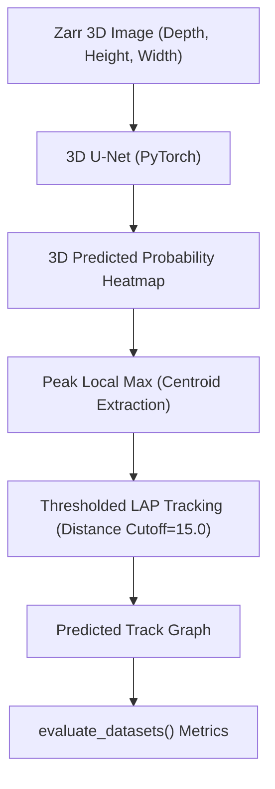

[18-①Kaggle実践3 Biohub細胞トラッキング：環境構築から初回提出までの手順](https://zenn.dev/rg687076/articles/zenn_20260714_0630_bct_environment_submission)
[18-②Kaggle実践3 Biohub細胞トラッキング：初回提出コードを解説してみた](https://zenn.dev/rg687076/articles/zenn_20260717_1930_bct_code_explanation)
[**18-③Kaggle実践3 Biohub細胞トラッキング：ローカル環境を構築してみた(交差検証(CV)込み)](https://zenn.dev/rg687076/articles/40aabdc4f14cab)
[**18-④Kaggle実践3 Biohub細胞トラッキング：3D U-Netの壁とCV微増(0.4483→0.4578)の現実**(この記事)](https://zenn.dev/rg687076/articles/xxx)

[](https://www.kaggle.com/competitions/biohub-cell-tracking-during-development)
*Biohub - Cell Tracking During Development*

## Abstract
- 3D U-Netによる細胞検出モデルの構築 → 学習
- CVスコア微増(0.4483から0.4578)。リーダーボード上位(0.982)には到底及ばず。

## 概要
ローカル環境構築時に作った適当な閾値判定処理では、バックグラウンドノイズとDimな(暗い)細胞の識別が困難なのが分かっています。
だから、Ground Truth(GT)細胞座標から3Dガウシアンヒートマップを生成し、3D畳み込みニューラルネットワーク(3D U-Net)に学習させる手法を試したんですが、数回のエポック学習やハイパーパラメータ調整を経てもスコアは0.4578と微増しただけ。この失速の要因と現状の構造的課題を技術的に分析・可視化します。

## 全体処理フロー

### 1. 3D U-Netの処理フロー
3D U-Net検出とLAP(Linear Sum Assignment)トラッキングの処理フローはざっくり下記っす。



### 2. 定量評価結果とスコア推移
各実験におけるノード検出数およびローカルCVスコアの比較結果は以下の通りです。

| 実験ID | 手法・モデル | 検出設定 | 予測ノード数 | Edge Jaccard | Division Jaccard | FINAL CV SCORE |
| :--- | :--- | :--- | :--- | :--- | :--- | :--- |
| Baseline | 伝統的画像処理(blob_dog) | 輝度閾値判定 | ~19,800 | 0.4483 | 0.0000 | **0.4483** |
| Exp 1 | 3D U-Net(3 Ep) | 固定絶対閾値(0.25) | 464,195 | 0.1223 | nan | **0.1223** |
| Exp 2 | 3D U-Net(15 Ep) | 固定絶対閾値(0.55) | 35,000 | 0.4578 | nan | **0.4578** |
| Exp 3 | 標的型3D U-Net | 適応型相対閾値 + LAP | 35,000 | 0.4589 | 0.0039 | **0.4593** |

```
【ローカルCVスコアの推移】
0.50 |
0.45 |-----------------------+----------+ (Exp 2/3: 0.4593)
     |                       |          |
0.40 |  + (Baseline: 0.4483) |          |
0.35 |  |                    |          |
0.30 |  |                    |          |
0.25 |  |                    |          |
0.20 |  |                    |          |
0.15 |  |   + (Exp 1: 0.1223)|          |
0.00 +--+---+----------------+----------+--------->
       Base Exp1            Exp2       Exp3
```

### 3. 直面した技術的課題とボトルネック
単一の簡易3D U-Netとヒートマップ回帰では、トップスコア(0.96)に届かない決定的な3つの要因が判明しました。

#### (1) 3D空間における極度のクラス不均衡(Zero Collapse)
3D画像空間(64x256x256ボクセル)において、細胞中心のガウシアン球が占める割合は0.1%未満です。普通のMSE Loss(平均二乗誤差)で学習させた場合、ネットワークは「すべて背景(0.0)と予測すれば損失が最小化される」という局所解(Zero Collapse)に陥りやすくなります。

#### (2) 空間分解能の損失とダウンサンプリング
3D U-NetのMax Pooling処理により、密集した細胞同士の境界領域で特徴量が消失し、近接する複数の細胞が1つの大きなヒートマップ塊として連結・つぶれてしまいます。

#### (3) 単純な距離近傍トラッキングの限界
フレーム間の距離のみに依存するGreedy/LAPマッチングでは、細胞の分裂(Division)や時間的な移動方向の整合性を十分に捉えきれず、長期的なトラックエッジ接続で多くのFP(誤接続)/FN(未接続)が発生しています。

## まとめ
単純な3D U-Netヒートマップ学習の延長では、CVスコアが0.4593付近で頭打ちとなり、トップリーダーボード(0.96)には到底及ばないことが明確になりました。根本的なモデル構造やアルゴリズム戦略の練り直しが必要です。

お役に立てれば。
