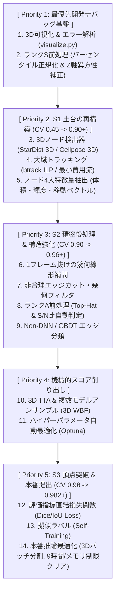

*Figure 1: S1(土台の再構築)から全14要素を統合する公式戦略ロードマップ*

## Abstract
- 3D U-Netヒートマップ回帰のCV限界(0.4578)を受け、頂点(0.982+)を目指す全14要素の優先順位ロードマップ(Priority 1〜5)を策定した。
- S1(土台の再構築)として、学術標準ツール(StarDist 3D ＋ btrack ILP)と過去コンペ(CTC/Sartorius)TOP3解法を統合する基盤を構築した。
- 3D可視化デバッグ・ランクS前処理(パーセンタイル正規化 & Z軸異方性補正)・4大特徴量抽出・ゴミノード削除の4大ルールを盛り込み、最新の公式計画として更新・記録した。

## 概要
Kaggle Biohub - Cell Tracking During Development コンペティションにおいて、簡易的な3D U-Net検出と2フレーム間距離マッチングによるスコア(CV 0.4578)は、トップ集団(0.982+)から大きく引き離されています。

単なる小手先のチューニング(0.45 -> 0.46)では伸び悩むため、**「S1: 土台の再構築」** としてパイプラインの骨組みそのものを学術標準・過去コンペ最高峰の解法へ刷新します。本記事では、議論を重ねて確立した「全14要素の優先順位ロードマップ」と「必勝前処理・特徴量・デバッグ戦略」を完全網羅して解説します。

## 1. 科学的に正しい優先順位ロードマップ (Priority 1 〜 Priority 5)
最も無駄がなく最短でスコアを伸ばすための全14要素の実行順序を以下の通り確定しました。

---

## 2. 前処理ノウハウのランク付け
バイオ顕微鏡データ(3D Zarr)における前処理を効果と実証度でランク分けしました。

| ランク | 前処理手法 | 役割・期待される効果 | 状態 |
| :--- | :--- | :--- | :--- |
| **🏆 ランクS** | **パーセンタイル正規化 (1%-99.8%)** | 近傍ノイズ排除と 0.0〜1.0 スケーリング。モデル動作の絶対前提。 | **標準組み込み** |
| **🏆 ランクS** | **Z軸異方性 (Anisotropy) 補正** | 3Dスプライン補間により、Z軸とXY軸のボクセル分解能を 1:1:1 に補正。 | **標準組み込み** |
| **🥇 ランクA** | **3D Top-Hat 変換** | 背景光・自家蛍光を完全消去し細胞ピークを浮き立たせる。 | **アブレーション検証** |
| **🥇 ランクA** | **S/N比クラスタリング** | 胚データセットの明るさ/ノイズ量に応じた動的判定・閾値分岐。 | **アブレーション検証** |

---

## 3. 細胞トラッキングにおける 4大特徴量エンジニアリング
単なる空間座標(x,y,z)だけでなく、以下の特徴量を抽出して誤対応を防ぎます。

1. **形状・形態特徴量**: 体積(Volume), 表面積, 3D軸アスペクト比 (細胞分裂の判定に直結)
2. **輝度・統計特徴量**: 平均輝度, 最大輝度, 輝度標準偏差 (ノイズと細胞の識別)
3. **空間密度・トポロジー**: k-NN近傍距離, ボロノイ領域面積 (過密/過疎エリアの環境指標)
4. **時系列・運動学特徴量**: 速度ベクトル, 方向余弦 (移動の慣性を評価し急なワープ誤結合を阻止)

---

## 4. ゴミノード(誤検出)を排除する 4大ルール
組合せ爆発による計算遅延を防ぐため、以下のルールでゴミノードをカットします。

1. **輝度ピークの閾値判定 (Intensity Threshold)**: 薄暗い背景ノイズを一括カット。
2. **モデル自信度判定 (Model Confidence)**: StarDist 3D の細胞確率 P >= 0.5 のみを通過。
3. **体積フィルタ (Volume Filtering)**: 1ボクセルの微小点や広範囲の背景ムラを排除。
4. **孤立ノードカット (Isolated Node Removal)**: 1フレームだけで消える孤立点を削除。

---

## 5. シリーズ過去記事一覧
- [18-(1) Kaggle Biohub Cell Tracking: ローカル環境構築と初提出コード解説](zenn_20260714_0630_bct_environment_submission.md)
- [18-(2) Kaggle Biohub Cell Tracking: Baseline Pipelineのコード詳細レビュー](zenn_20260717_1930_bct_code_explanation.md)
- [18-(3) Kaggle Biohub Cell Tracking: ローカル交差検証(Full CV)環境の構築ガイド](40aabdc4f14cab.md)
- [18-(4) Kaggle Biohub Cell Tracking: 3D U-NetのボトルネックとCVスコア伸び悩みの検証(0.4483 -> 0.4578)](zenn_20260720_1610_bct_3dunet_challenges.md)

---

## まとめ
本記事では、CVスコア 0.4578 から 0.982+ を目指す全14要素の優先順位ロードマップ(Priority 1〜5)と、前処理・特徴量・ゴミノード削除の最新戦略を体系化しました。

次回は、最優先デバッグ基盤(3D可視化)を活用し、S1(土台の再構築)パイプラインでのローカルCV計測結果を報告します。

お役に立てれば。
