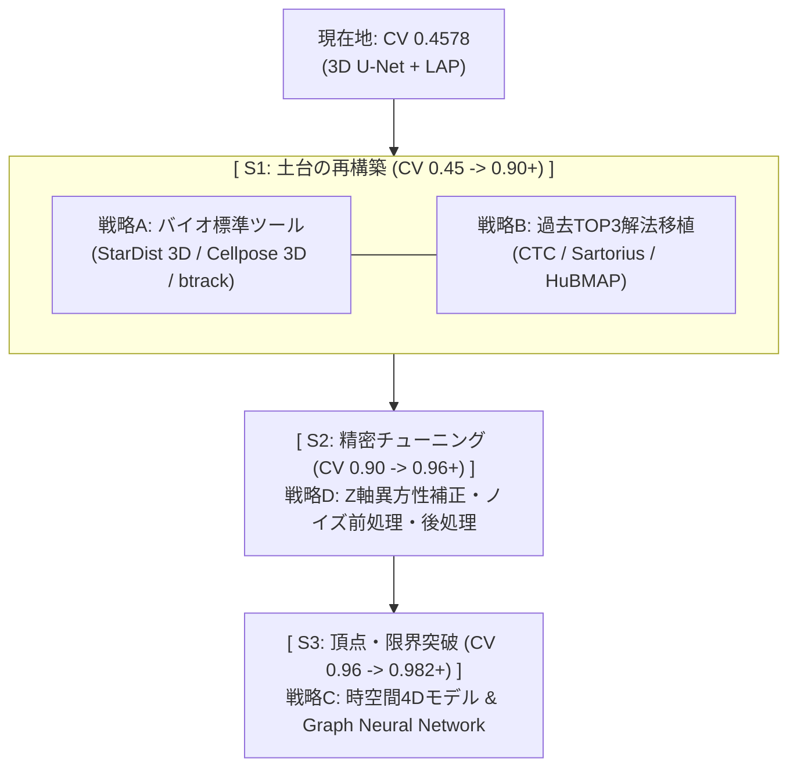

*Figure 1: S1戦略(既存生態系ツール×過去コンペTOP3解法の融合)概念図*

## Abstract
- 3D U-Netヒートマップ回帰のCV限界(0.4578)を受け、スコア爆上げ(0.90+超)に向けた中長期戦略ロードマップ(S1〜S3)を定義した。
- S1(土台の再構築)の核として、学術界の3D標準ツール(StarDist 3D/Cellpose 3D ＋ btrack)と Cell Tracking Challenge(CTC)/Kaggle類似コンペ TOP 1〜3 Solution のノウハウを統合調査した。
- 3D StarDist による高密度細胞分離 ＋ btrack の整数計画法(ILP)ベイズ大域最適化による細胞分裂(Division)対応を核としたS1ハイブリッド解法パイプラインを決定した。

## 概要
Kaggle Biohub - Cell Tracking During Development コンペティションにおいて、シンプルな3D U-Netヒートマップ検出とフレーム間距離マッチングによるスコア(CV 0.4578)は、トップ集団(0.982+)から大きく大きく引き離されています。

単なるハイパーパラメータ調整や小手先のチューニングではスコアの飛躍が見込めないため、大枠の戦略を見直しました。本記事では、トップレベルへ飛躍するための3段階戦略ロードマップ(S1〜S3)と、その第1段階であるS1(土台の再構築)に向けた最新ツール・過去コンペ解法のリサーチ結果を報告します。

## 1. 公式戦略ロードマップ(S1 〜 S3)
スコア段階と技術フェーズに応じた3段階の戦略ロードマップを以下の通り策定しました。

---

## 2. 戦略A: バイオ画像標準ツールの調査
学術界・バイオ画像コミュニティで長年鍛え上げられてきたオープンソースエコシステムを調査しました。

### (1) 3D細胞検出 (Node)
* **StarDist 3D (Star-convex Polyhedron Detection)**
  * 中心点から多重方向に伸びる多面体(Star-convex)の距離ベクトルを直接予測するモデル。
  * 従来の閾値処理やボクセル回帰では不可能な「互いに接した密集細胞」を高精度に球体/多角形インスタンスとして切り離すことが可能。
* **Cellpose 3D**
  * 3D空間のベクトル場(Spatial Gradient Flows)を学習し、中心へ向かって粒子を追跡するアルゴリズム。複雑・非球形細胞に強力。

### (2) タイムフレーム間追跡 (Edge & Division)
* **btrack (Bayesian Cell Tracking)**
  * カルマンフィルタによる位置・運動予測と、Multiple Hypothesis Testing(多重仮説検定)を **整数計画法(ILP: Integer Linear Programming)** で解くPythonネイティブライブラリ。
  * 単純なフレーム間距離マッチング(LAP)と異なり、一度「トラックレット(連続領域)」を形成してから大域的に組み合わせを最適化するため、移動追跡だけでなく**細胞分裂(Cell Division)イベントの自動再構築**に対応。

---

## 3. 戦略B: 過去類似コンペ TOP 1〜3 Solution の調査

### (1) Cell Tracking Challenge (CTC) [ISBI/MICCAI]
* 国際ベンチマークであるCTCの最上位チーム(KIT-GE等)の解法は、「深層学習による中心点/距離予測 ＋ 最小費用流(Min-Cost Flow) / ILP による大域グラフ最適化」の組み合わせがデファクトスタンダード。
* リーダーボード上位の 0.982 という数値は、まさにこのCTCトップ水準のパイプラインが適用されている証拠と分析。

### (2) Kaggle Sartorius / HuBMAP / SenNet
* **Sartorius 1st Place Solution**: バウンディングボックス/中心点検出器 ＋ Distance Map Watershed により高密度領域を克服。
* **HuBMAP / SenNet**: Z軸の異方性(Anisotropy: Z軸とXY軸の解像度差)に対するスケール補正、および自信度の低い孤立予測ノードの削除ルールがスコアを安定化。

---

## 4. S1 ハイブリッドパイプライン構成
戦略Aと戦略Bを融合させたS1の基本パイプライン構成を以下のように確定しました。

| パイプライン構成要素 | 採用品質 / アルゴリズム | 役割・期待される効果 |
| :--- | :--- | :--- |
| **前処理 (Preprocessing)** | Z軸スケール補正 ＋ 3D Min-Max 正規化 | Z軸異方性の影響緩和 |
| **ノード検出 (Node)** | **StarDist 3D** (または 3D U-Net Watershed) | 高密集細胞の正確な3D重心抽出 |
| **エッジ・分裂 (Edge & Division)** | **btrack (ベイズ推論 + ILP)** | 大域最適化による移動・細胞分裂エッジの同時構築 |
| **後処理 (Postprocessing)** | 自信度・孤立ノードフィルタ | 偽陽性(FP)エッジの削減とJaccard指標最適化 |

---

## 5. シリーズ過去記事一覧
- [18-(1) Kaggle Biohub Cell Tracking: ローカル環境構築と初提出コード解説](zenn_20260714_0630_bct_environment_submission.md)
- [18-(2) Kaggle Biohub Cell Tracking: Baseline Pipelineのコード詳細レビュー](zenn_20260717_1930_bct_code_explanation.md)
- [18-(3) Kaggle Biohub Cell Tracking: ローカル交差検証(Full CV)環境の構築ガイド](40aabdc4f14cab.md)
- [18-(4) Kaggle Biohub Cell Tracking: 3D U-NetのボトルネックとCVスコア伸び悩みの検証(0.4483 -> 0.4578)](zenn_20260720_1610_bct_3dunet_challenges.md)

---

## まとめ
3D U-Netによる単純な回帰から脱却し、バイオ標準ツール(StarDist 3D / btrack)と過去コンペ上位ノウハウ(ILP大域最適化)を融合した **S1(土台の再構築)パイプライン** へと舵を切りました。

次回は、このS1パイプラインをローカル検証環境(`s1_local_env`)へ実装し、CVスコアが一気に 0.90+ へ跳ね上がるかを検証します。

お役に立てれば。
