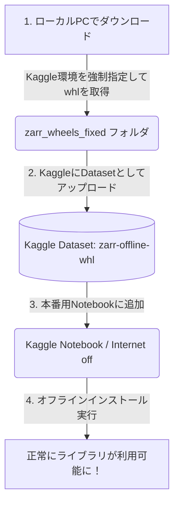

*コンペティション「Biohub - Cell Tracking During Development」のヘッダー画像*

### Abstruct
Kaggleのコードコンペティション(インターネット接続不可)において、プリインストールされていない外部ライブラリ(例: `zarr`)を安全かつ確実にオフラインインストールする手順を解説します。

---

### 概要
Kaggleの画像処理系などのコンペティションでは、最終提出(Submit)の実行時に「インターネット接続オフ(Internet off)」が義務付けられることが多くあります。
この環境下で、通常通り `!pip install` を実行するとエラーになり提出が失敗してしまいます。

この記事では、ローカルPCを使ってKaggle環境(Linux/Python 3.12)に適合するパッケージファイルをあらかじめ準備し、オフライン環境下でインストールするための「正しいアプローチ」をステップ・バイ・ステップで解説します。

---

### 全体フロー
オフラインインストールの仕組みは以下のようになっています。



---

### 実装手順

#### 1. ローカルPCでパッケージファイルをダウンロードする
コマンドプロンプト(cmd)を開き、以下のコマンドを実行します。
ダウンロード時には、ローカルPCの環境に引きずられないよう、**Kaggle環境(Linux/Python 3.12)を強制指定するオプション**を付与します。

```cmd
pip download zarr -d ./zarr_wheels_fixed --only-binary=:all: --platform manylinux2014_x86_64 --python-version 3.12 --implementation cp
```

これによって、指定したフォルダ内に `numcodecs` などの依存関係も含めた複数の `.whl` ファイルがダウンロードされます。
ダウンロード完了後、以下のコマンドでフォルダを開いておきます。

```cmd
explorer ./zarr_wheels_fixed
```

#### 2. Kaggleにデータセットとしてアップロードする
1. Kaggleの「Datasets」ページから **「New Dataset」** をクリックします。
2. タイトルを入力(例: `zarr-offline-whl`)します。
3. 先ほど開いたエクスプローラーから、ダウンロードしたファイルをすべてドラッグ&ドロップし、アップロードします。
4. アップロード完了後、**「Create」** を押してデータセットを作成します。

#### 3. ノートブックにマウントしてオフラインインストールを実行する
1. 本番用のノートブックの右側パネルで、**「Internet off」** に設定します。
2. **「+ Add Input」** をクリックし、作成したデータセットをノートブックに追加します。

以下の画像のように、ご自身のWorkから検索して追加します。

*(※ここに検索絞り込みの画像を配置予定)*

3. ノートブックの一番最初のセルで、以下のコマンドを実行します。

```python
!pip install --no-index --find-links=/kaggle/input/datasets/aaaa1597/zarr-offline-installation-wheels/zarr_wheels_fixed zarr
```
これで通信を行わずにローカルマウントされたパスから安全にインストールが完了します。

---

### トラブルシューティング: 「データセットを修正したのにエラーが変わらない」罠

データセットのファイルをアップロードし直したり、同じ名前で作り直した場合に、前の古いエラー(バージョン不一致など)が解消されないことがあります。

これは**Kaggleセッション側が古いバージョンのマウントデータをキャッシュしてしまっている**ことが原因です。

#### 解決方法
1. 右側パネルの「Input」から、該当のデータセットを一度削除(ゴミ箱マーク)します。
2. 再度追加し直します。
3. 画面上部メニューの **「Run」 -> 「Restart session」** を押して、セッションを完全に再起動させてから再度実行します。

これを行うことでマウントデータが最新に更新され、エラーが解消されます。

---

### まとめ
インターネットオフの制約があるコンペでも、この「プラットフォーム指定のダウンロード」と「Kaggle Datasetの活用」を組み合わせれば、どんなライブラリでも自由に使用できます。

お役に立てれば幸いです。
